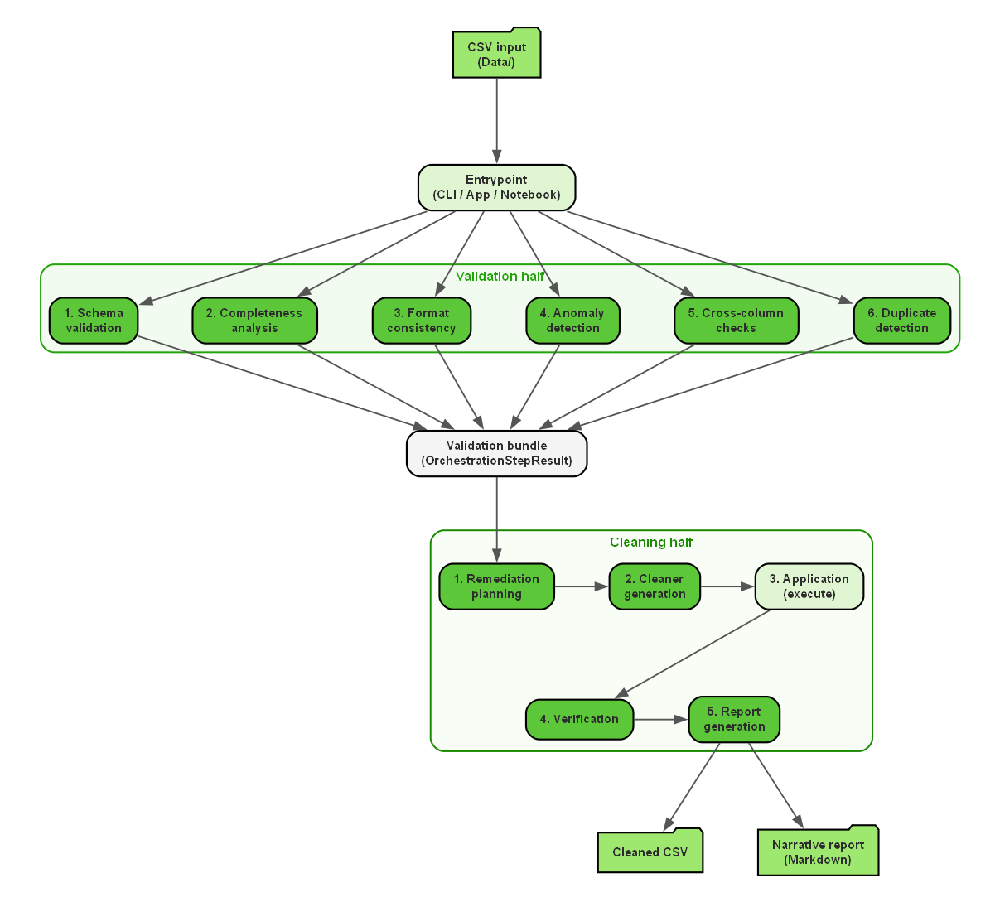
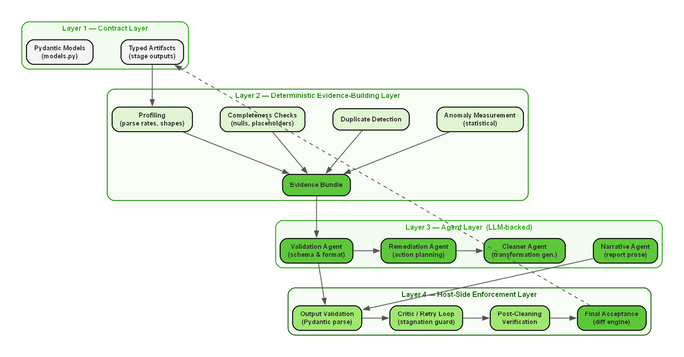
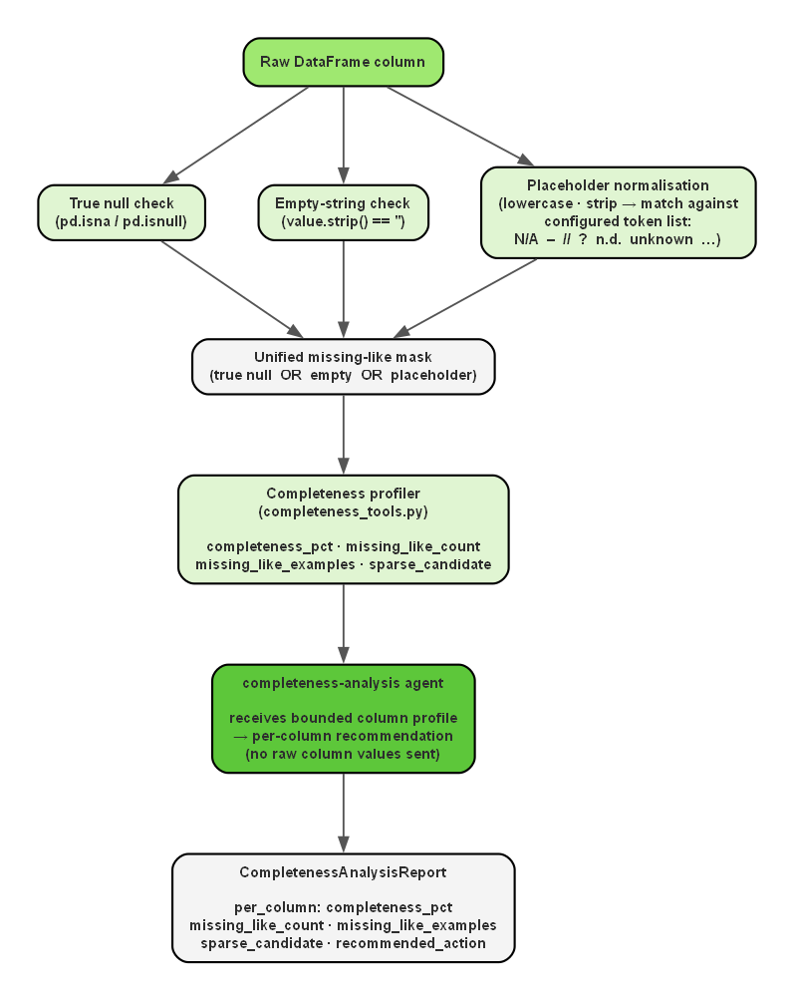
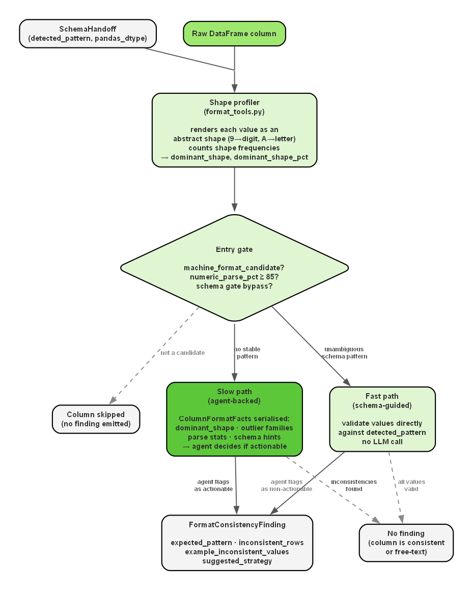
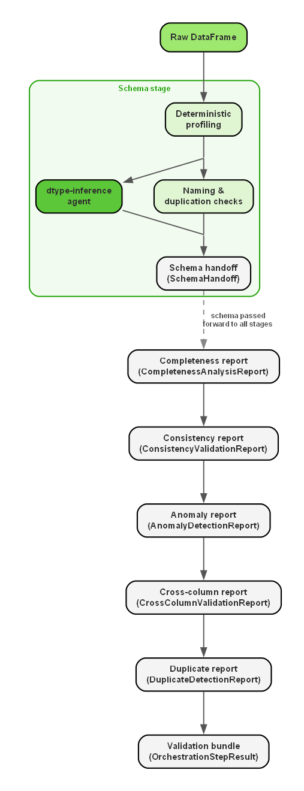
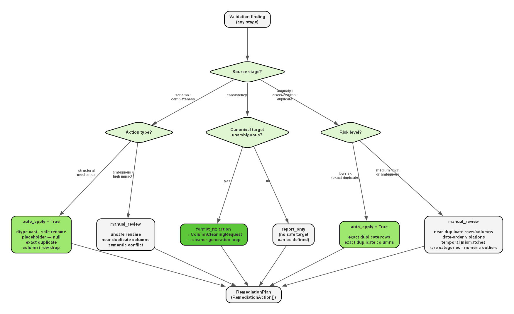
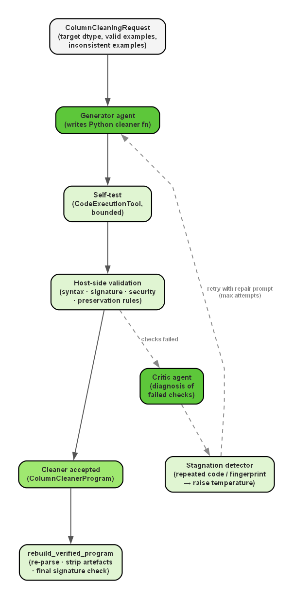
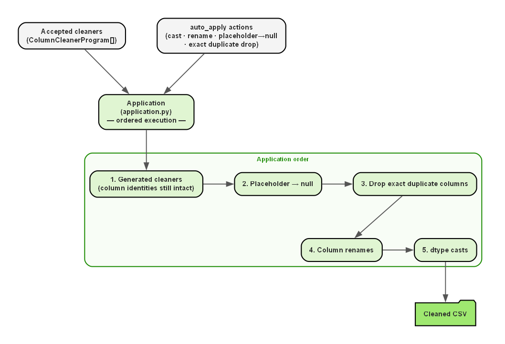
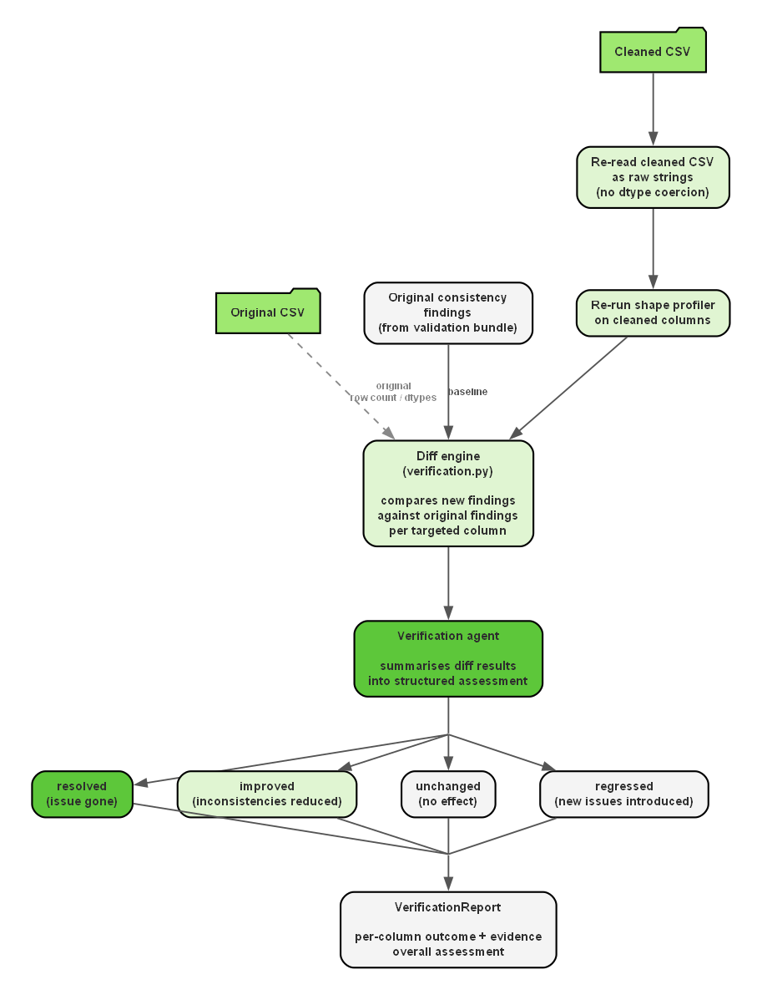
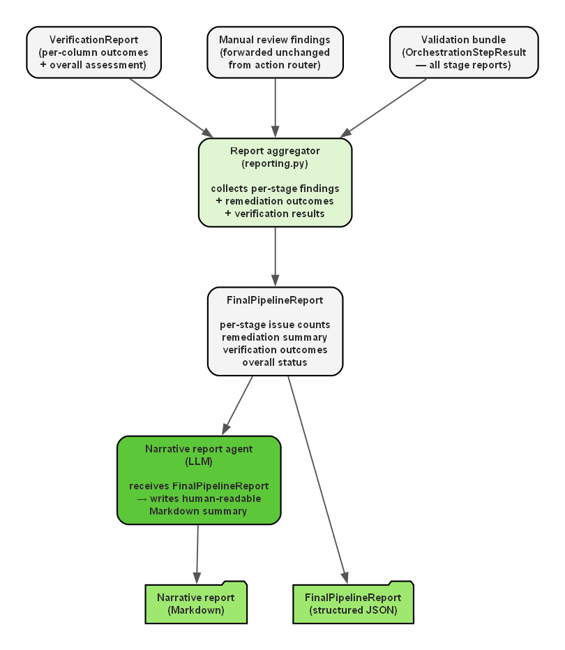

# NoiPA: Multi-Agent System for Data Quality

**Team members:** Michele Turco, Mattia Sebastiani, Sofia Bruni

This repository documents a project developed for the Machine Learning course for the academic year 2025/2026 in collaboration with Reply. The project studies how a **multi-agent system** can be used to inspect heterogeneous tabular data, identify several families of data-quality problems, apply controlled cleaning actions only where those actions are justified, and finally produce a report that explains both the detected issues and the effect of the remediation process. 

The **central idea** is that data quality should not be treated as a single undifferentiated task. Missing values, placeholder abuse, inconsistent formats, duplicate structures, suspicious anomalies, and cross-column contradictions are different problems and require different forms of evidence and different intervention policies.

## 1. Introduction

### 1.1 Project Context and Institutional Setting

The project originates from a **data-quality scenario inspired by NoiPA**, the digital platform of the Italian Ministry of Economy and Finance that manages administrative and payroll-related data for employees of the Italian Public Administration. In this setting, **data** may arrive from **different sources** and in **different formats**, such as CSV files, JSON exports, or database extracts. Even when the information is present, it may **not be immediately reliable** for analysis or downstream processing, because the same concept can be encoded in inconsistent ways across rows, columns, or files.

This kind of context is particularly suitable for a data-quality project because the **main difficulty** is not the lack of data alone, but the **gap** between **availability and usability**. A dataset may look populated while still being difficult to trust. Dates can appear in several incompatible formats within the same column. Columns may contain numeric values mixed with textual decorations. Placeholder tokens may hide missingness behind apparently non-null strings. Distinct columns may duplicate one another semantically or contradict one another logically. If these issues are not isolated carefully, **later analysis inherits uncertainty** that is often **invisible at first sight**.

### 1.2 Problem Statement

The problem addressed by the project is therefore broader than simple data cleaning. The **task** is to **design a system** that can receive a raw dataset, inspect it systematically, **understand which quality issues are actually present**, decide which **actions are safe to perform automatically**, **generate constrained transformations** when normalization is justified, and **verify that the transformations** improved the data instead of damaging it.

This **distinction** is essential. A **generic instruction** such as "clean this CSV" can easily **produce outputs** that look **plausible but are difficult to justify**. It may become unclear which evidence supported a change, whether valid values were accidentally rewritten, whether the transformation was appropriate for the semantic meaning of the column, and whether the resulting dataset is genuinely better than the original one. For a project that aims to be auditable and reliable, **this level of opacity is not acceptable**.

### 1.3 Why This Project Is Strong: Core Contribution and Objective

The **objective** of the project is to build a **multi-agent workflow** that receives a raw tabular dataset and produces **two main outcomes**. The **first outcome** is a **cleaned dataset** produced through controlled and verifiable actions. The **second outcome** is a **structured quality report** describing the issues detected in the original data, the actions selected for remediation, and the extent to which those actions improved the dataset after verification.

The **practical goal** is straightforward: take a messy CSV file, clean it, and produce a report explaining what was wrong and what was fixed. Something you can actually hand to someone and use. The **methodological goal** is about **how you do it**. The point is not just to get a clean file. It is to show that there is a right and a wrong way to use AI agents for this kind of task. The wrong way is to simply ask an LLM to fix the data and trust whatever it gives back. The right way is to keep the AI on a short leash: let deterministic code do the measuring and profiling, force the AI to produce structured outputs that can be checked, make it write cleaning code that gets tested automatically before anything is applied to the real data.

So the deeper claim the project is making is this: the **pipeline design itself** is the **contribution**. The fact that **it works is not just lucky**. It works because of **specific choices about where to use AI and where not to**, and what checks to put in place at every step.

The **agentic approach is not an optional addition** to this design. It is what makes the design feasible. Some parts of the workflow inherently require **structured interpretation** that deterministic rules cannot supply: inferring a canonical dtype from a noisy column profile, writing a narrow normalization function for a specific pattern, or producing a concise structured summary of heterogeneous findings. These are tasks where an LLM, when properly bounded, contributes something that static code cannot replicate. At the same time, the **agentic components are never standalone**. Profiling parse rates, counting placeholder values, detecting duplicate patterns, or comparing columns are performed by Python before any model is involved. The agent receives **distilled evidence, not raw data**, and its output is always verified by the host environment before it is trusted. The result is a **staged multi-agent architecture** in which each agent answers a specific question, produces a typed artifact, and is prevented from becoming the sole authority over the data.

### 1.4 Repository Structure, Technology Stack, and Usage

The **repository** is organized to satisfy both **illustrative purposes** and the **engineering needs** of the system. It contains both **implementation code** and **explanatory material**, but the project should **not** be read as a notebook-only prototype. The main **explanatory notebook** is `main.ipynb`, which is intended to **explain the logic of the pipeline**, show **intermediate artifacts**, and provide a **narrative account of the workflow**.

The **same underlying pipeline** is exposed through **three execution surfaces**. The notebook is the didactic surface, the **command-line entrypoints** in `src/entrypoints/` allow the **stages to be executed individually or end to end** for operational use, and the **Streamlit application** in `app.py` exposes those stages through an **interactive interface**. The point is that the workflow can be studied, scripted, or used interactively without changing its internal logic.

The **main codebase** is under `src/`, and that is where the **real system logic** lives. It is organized into `core/` for shared logic and models, `tools/` for rule-based data processing, `validation/` for the inspection stages, `cleaning/` for planning fixes, generating code, applying changes, checking results, and reporting.

The **technological stack** combines `pandas` and `numpy` for dataframe manipulation and local measurement, [`pydantic`](https://docs.pydantic.dev/latest/) and [`pydantic-ai`](https://ai.pydantic.dev/) for typed agent handoffs, `openai` for the model interface, `python-dateutil` and `dateparser` for date normalization support, `streamlit` for the interactive application, and `logfire` for observability. In practical terms, this means that the project is not built around a notebook alone, but around a small engineered runtime in which deterministic Python code, typed contracts, LLM calls, and tracing infrastructure are combined inside one workflow.

```text
AgentsAI/
|-- src/
|   |-- core/
|   |   |-- agents.py              # Agent definitions, shared model setup, Logfire bootstrap
|   |   |-- cache.py               # Cache helpers for intermediate artifacts
|   |   `-- models.py              # Data models for typed stage handoffs
|   |-- tools/
|   |   |-- common_tools.py        # Shared utility helpers
|   |   |-- schema_tools.py        # Deterministic dtype profiling and naming checks
|   |   |-- completeness_tools.py  # Placeholder detection and completeness profiling
|   |   |-- format_tools.py        # Shape-based structural profiling
|   |   `-- quality_tools.py       # Anomaly, cross-column, and duplicate detection
|   |-- validation/
|   |   |-- schema.py              # Schema validation stage
|   |   |-- completeness.py        # Completeness analysis stage
|   |   |-- consistency.py         # Format consistency validation stage
|   |   |-- anomaly.py             # Anomaly detection stage
|   |   |-- cross_column.py        # Cross-column validation stage
|   |   |-- duplicates.py          # Duplicate-row detection stage
|   |   `-- bundle.py              # Validation bundle assembly
|   |-- cleaning/
|   |   |-- remediation.py         # Remediation planning stage
|   |   |-- request.py             # ColumnCleaningRequest construction
|   |   |-- generation.py          # Cleaner generation and critic-repair loop
|   |   |-- validation.py          # Host-side cleaner validator
|   |   |-- application.py         # Apply cleaners and structural actions
|   |   |-- verification.py        # Post-cleaning verification against original findings
|   |   |-- reporting.py           # FinalPipelineReport assembly
|   |   `-- orchestrator.py        # End-to-end cleaning orchestration
|   `-- entrypoints/
|       |-- cli.py                 # Argument parsing
|       `-- main.py                # Stage-level orchestration entry point
|-- Data/
|   
|-- images/
|-- app.py                         # Streamlit interactive interface
|-- main.ipynb                     # Explanatory notebook
|-- requirements.txt
`-- .env                           # OpenAI API key and optional Logfire token (local only)
```


### 1.5 Reproducibility and Environment

The repository includes a `requirements.txt` file and can be reproduced with a standard virtual environment. A minimal local setup is:

```powershell
python -m venv .venv
.venv\Scripts\activate
pip install -r requirements.txt
```

On **macOS** (and more generally Unix-like shells), the equivalent setup is:

```bash
python3 -m venv .venv
source .venv/bin/activate
pip install -r requirements.txt
```

Once the environment is activated, the Streamlit and CLI commands shown below are the same on Windows and macOS.

Agent-backed stages require an `OPENAI_API_KEY`. The project loads environment variables from `.env` through `python-dotenv`, so the intended setup is to create a `.env` file in the repository root with:

```dotenv
OPENAI_API_KEY=your_openai_api_key_here
LOGFIRE_TOKEN=your_logfire_token_here  # optional
```

The `LOGFIRE_TOKEN` is optional and enables the observability tracing described in Section 2.3.

After the environment is ready, you can use the notebook, the CLI, or the Streamlit app. The Streamlit application can be launched with:

```powershell
streamlit run app.py
```

The command-line pipeline can be run through the packaged entrypoint. For example, the validation bundle can be built with:

```powershell
python -m src.entrypoints.main Data/spesa.csv --stage validate
```

The same CLI interface also exposes `dtype`, `schema`, `completeness`, `consistency`, `remediate`, `generate`, `apply`, `verify`, `clean`, and `report`.


## 2. Methods

### 2.1 General System Architecture and Conceptual Design

The **overall architecture** is based on a **strict separation** between inspection, diagnosis, remediation planning, transformation, and verification. This choice reflects the view that heterogeneous data-quality problems are handled more safely when the workflow is decomposed into narrower stages with explicit responsibilities.



A **broad architectural overview** of the system is useful because it makes visible the **main split between the validation half and the cleaning half**, while still preserving the end-to-end flow from raw CSV input to cleaned dataset and narrative report.

The workflow begins by **loading a dataset** and **building deterministic evidence** about it, then **translating those observations** into **structured findings**. Only after those have been formalized does the system decide whether a **corrective action** is **justified**. When executable **cleaning logic** is needed, the latter is **generated** under a **narrow contract** and is **validated** by the host system before being trusted. After application, the dataset is checked again to confirm that the **targeted issue** was actually reduced.

This architecture serves **two purposes**. The first is **technical safety**. If one stage fails, the failure can be localized instead of contaminating the rest of the workflow invisibly. The second is **interpretability**. Because every stage emits a specific typed artifact, the intermediate state of the system can be inspected, cached, reloaded, and discussed both in the notebook and in the final report.

Conceptually, the system can be read as a **four-layer architecture**. The **first layer** is the **contract layer**, in which [Pydantic](https://docs.pydantic.dev/latest/) models define the typed artifacts exchanged across stages. The **second layer** is the **deterministic evidence-building layer**, in which local Python code measures parse rates, shapes, placeholders, duplicates, and anomalies without asking the model to rediscover raw facts. The **third layer** is the **agent layer**, where LLMs are used only for narrow interpretive or generative tasks that benefit from bounded reasoning. The **fourth layer** is the **host-side enforcement layer**, which remains the final authority whenever generated outputs must be validated before acceptance. 



This decomposition is important because it explains why the pipeline remains both flexible and auditable: interpretation is delegated selectively, while structure, evidence, and final acceptance stay under explicit programmatic control.

### 2.2 Contract Layer and Typed Artifacts
One of the defining engineering choices of the system is the use of **[Pydantic](https://docs.pydantic.dev/latest/) models** as a **contract layer**. The file `src/core/models.py` defines the **structured objects** that move from one stage to another. In this context, a **schema** is an explicit description of what a stage is allowed to produce and what a downstream stage is allowed to expect. This means that the **output** of a stage is not a free-form paragraph that must later be reinterpreted, but a **validated artifact** with an explicit **schema**.

For example, a raw column may arrive in pandas as generic `object` data, while the schema-stage handoff can still declare that the cleaned target should be `datetime64[ns]` with a canonical `ISO 8601 / date-time` pattern. Downstream stages then receive not just "some text about the column," but a structured statement of what that column is supposed to become after cleaning.

This choice is central to the **reliability of the pipeline**. In an **agentic workflow**, one of the main **risks** is not only that a stage may produce an incorrect answer, but that it **may produce an answer with the wrong structure**. A **malformed handoff** can **silently poison every downstream stage**. Typed artifacts reduce this risk and improve traceability. They also make it possible to cache intermediate results, compare runs, and expose internal state clearly in the notebook and in the application.

### 2.3 Agent Runtime, Retries, and Observability

All **agents are defined** centrally in `src/core/agents.py`, and all runtime control is routed through **shared utilities**. This layer exists because **LLM calls** are the **least deterministic** and most failure-prone component of the pipeline. Rate limits, transient connection failures, and inconsistent retry logic would make the system difficult to reason about if every module handled them independently.

The runtime therefore **centralizes model configuration**, tracing, and retry policy. **Logfire** is used for **observability**. The **current configuration** in `src/core/agents.py` sets the shared model to `openai-responses:gpt-5.4-nano`, although the design allows the model choice to be changed in one place rather than scattered across the codebase. This **centralization supports repeatability and debugging**: a failed agent call can be inspected as a single event inside a larger engineered process.


The Logfire trace displays **individual agent runs as separate observable events**, therefore making the **operational structure** of the pipeline visible during execution, rather than only after the final artifacts have been written. This makes it possible to audit exactly what the pipeline did during a run, at what cost, and where failures or retries occurred.

### 2.4 Detailed Pipeline Stages

The following subsections describe the ordered validation, remediation, cleaning, verification, and reporting stages that make up the operational pipeline.

#### 2.4.1 Data Ingestion and Initial Framing

The **dataset** is loaded into a pandas dataframe and becomes the **authoritative input for validation**.

In the **verification stage**, the **cleaned output may be re-read** as **strings** so that **formatting differences** are not hidden by automatic dtype normalization. This detail is important because the **system evaluates** not only semantic compatibility but also whether the cleaned values respect the **intended canonical representation**. In other words, the **system** is **not satisfied** by a **value that merely parses**; it also **cares** whether the **value has been normalized into the correct target form**.

#### 2.4.2 Schema Validation
After the raw dataframe has been loaded and framed, **schema validation** becomes the **first domain-facing stage**. Its **purpose** is to **establish what each column is supposed** to **represent after cleaning**, rather than merely describing how the raw values happened to be stored. This **distinction is fundamental**. A column may be loaded as strings while still being, in substance, a date field or a numeric field corrupted by a minority of messy values. What the **system tries to understand** is what a **certain column is meant to represent rather than how it happens to be encoded** in the raw data. The **schema handoff makes this visible** in a concrete way.

Each column that passes through the schema stage produces a `SchemaHandoff` entry. The most important fields in that entry are `pandas_dtype`, which is the inferred target dtype after cleaning, and `detected_pattern`, which is the canonical form the cleaned values should follow. Both fields are produced by the `dtype-inference` agent from the bounded column profile.

``` json
    {
      "name": "aggregation-time",
      "pandas_dtype": "datetime64[ns]",
      "numeric_role": null,
      "string_role": null,
      "detected_pattern": "ISO 8601 / date-time",
      "rationale": "Datetime parse is 99.0% with clear timestamp/date strings (e.g., '2024-03-11T02:01:04.421', '24.10.2024'). Minority non-standard formats are treated as corruption; cleaned dtype is datetime64[ns].",
      "non_null_rows": 7543,
      "distinct_non_null_values": 66,
      "numeric_parse_pct": 0.0,
      "datetime_parse_pct": 99.03221529895268,
      "empty_like_pct": 0.0,
      "sample_values": [
        "2024-03-11T02:01:04.421",
        "2024-07-11T03:01:16.866",
        "2024-09-11T03:01:11.704",
        "2024-05-11T03:01:07.269",
        "2024-11-11T02:00:28.485"
      ],
      "naming_valid": false,
      "rename_suggestion": "aggregation_time",
      "naming_reason": "Column name contains a hyphen, which violates the lowercase snake_case naming rule."
    }
```
The `detected_pattern` field is the value that the consistency stage (Section 2.4.4) will later use as a semantic contract when deciding whether observed value shapes count as inconsistent.

The stage begins with **deterministic profiling** in `src/tools/schema_tools.py`. It computes non-null counts, distinct counts, numeric parse percentages, datetime parse percentages, and representative value samples. 

One particularly important **design choice** is that the `dtype-inference` prompt does **not receive the whole column**. It receives a **bounded instance of the column** built from a random sample of up to **5% of dataset rows**, capped at **500 unique non-null values per column**, together with the column name and whole-column parse statistics. 

This is a deliberate **compromise between interpretability and cost efficiency**. The system does not rquire to spend **tokens** on entire columns when the purpose of the stage is conceptual inference rather than exhaustive memorization, so it gives the LLM a **bounded local view** through the sample and a **global statistical view** through whole-column parse percentages. The sample is not enough to reproduce the full empirical distribution of a large column, but it is often enough to show what the column is trying to represent. If, for example, the raw pandas dtype is `object` but the sampled values are all strings corresponding to numbers between `1` and `12`, the agent can reasonably infer that the true cleaned dtype should be `Int64` rather than free text. In the same way, a column whose raw values are strings may still clearly reveal itself as a date field, a code, or a decimal measure once the sampled values are read together with the column name. This is what allows the system to remain relatively economical while **still making a semantically informed dtype decision**.

The same `dtype-inference` call **returns** not only the **target cleaned pandas dtype**, but also the **semantic role of the column and a dominant canonical pattern** when that pattern is clear enough. In other words, the dominant pattern is not deferred to a second dtype-inference call. It is **already part of the schema-stage inference**. In parallel, **deterministic naming checks identify unsafe column names** and **duplicate-semantic groups**. The **result** is merged into a structured `SchemaHandoff`.


This **hybrid design is deliberate**. **Parse rates and naming rules** are **straightforward deterministic checks**. Interpreting a messy profile as a cleaned target dtype benefits from semantic reasoning, but only when that reasoning is grounded in bounded evidence rather than raw unrestricted data.

#### 2.4.3 Completeness Analysis

Completeness analysis exists because missingness in real datasets is often **disguised**, so a naive null count is usually insufficient. The system therefore defines a **list of potential placeholder tokens** such as `N/A`, `-`, `unknown`, and empty strings, normalizes raw cell values against that list, and treats matches as **missing-like** rather than genuine content. This matters because many administrative datasets contain cells that are technically non-null but still informationally empty.

Starting from this placeholder list, `src/tools/completeness_tools.py` **builds a deterministic completeness profile**. It computes completeness percentages, detects missing-like tokens, records representative placeholder examples, and marks sparse columns. More specifically, the completeness logic constructs a **missing-like mask** that merges true nulls, empty strings, and configured placeholder values into one unified notion of absence. 



This profile is then **interpreted** by the `completeness-analysis` agent, which **returns** a **structured report with per-column recommendations**.

``` json
    {
      "column_name": "ente",
      "completeness_pct": 96.26143444252949,
      "missing_like_count": 282,
      "missing_like_examples": [
        "unknown",
        "",
        "//",
        "?",
        "n.d.",
        "-"
      ],
      "sparse_candidate": false,
      "recommended_action": "Targeted review of missing/placeholder-like values in this column; standardize placeholder tokens (e.g., unknown, //, n.d., -) and empty strings upstream."
    }
```

The **role of the agent** at this stage is not to discover missingness independently, but to transform **measured evidence** into a downstream-readable handoff. The **practical benefit** is that later stages do not need to repeat the same reasoning. They receive an **explicit statement** of which columns contain hidden missingness, which placeholder families are present, and whether some columns should be reviewed because they contain almost no meaningful information.

#### 2.4.4 Format Consistency Validation

**Format consistency validation** connects diagnosis to executable cleaning. Its purpose is to **identify columns whose values are semantically similar but structurally inconsistent** in ways that justify normalization. Typical examples include mixed date layouts, mixed encodings for period identifiers, or numeric fields that include punctuation or textual noise.

##### Inputs from the Schema Handoff

The consistency stage does not start from scratch. It receives the **schema handoff** described in Section 2.4.2, which already carries the **target cleaned dtype** and, when available, the **`detected_pattern`** inferred during schema inference. That pattern is semantic and canonical: it expresses what the column should mean and what form its values should take after normalization — for example `YYYYMM period key`, `4-digit year`, or `month number (1-12)`. The consistency stage then **complements that semantic contract with a raw structural profile** computed directly from the observed values in `src/tools/format_tools.py`.

##### Shape Profiling

The structural profile is built by **rendering non-null, non-empty values as strings** and **abstracting them through a shape function**. The shape function replaces every digit with a representative digit placeholder and every letter with a letter placeholder, collapsing consecutive identical placeholders, so that surface structure is captured without retaining actual content. For example, `202402` becomes `999999`, `04/2024` becomes `99/9999`, and `2025-06-18T16:15:20.148346` becomes a timestamp shape. The profiler counts how often each shape appears, ranks them by frequency, and defines the **`dominant_shape`** as the most frequent one among the filtered values. Its relative prevalence is stored as **`dominant_shape_pct`**. Both fields appear in the `ColumnFormatFacts` object passed to the agent on the slow path.

The **relationship between `detected_pattern` and `dominant_shape`** operates at different levels of abstraction and the two fields answer different questions:

- **`detected_pattern`** answers *"what should this column look like?"* — produced by the LLM from a bounded profile and a column name, it is the normalization target.
- **`dominant_shape`** answers *"what does this column look like right now, in the majority of rows?"* — produced deterministically from the raw values as they actually appear.

In practice, the two can align closely or diverge significantly. For `rata` in `spesa.csv`, the `detected_pattern` is `YYYYMM period key` and the `dominant_shape` is `999999`: a direct match. For `mese` in `attivazioniCessazioni.csv`, the `detected_pattern` is `month number (1-12)`, but the raw shapes split between `9` for single-digit months such as `7` and `99` for two-digit months such as `11`, with additional textual shapes for forms like `NOV` or `Novembre`. There the `detected_pattern` declares the target, while the `dominant_shape` distribution reveals the extent of drift and which shape families should be treated as already valid versus inconsistent.

##### Entry Gate Conditions

Before either execution path is taken, two gate conditions extend coverage beyond the shape-based heuristic alone.

1. **Schema-driven bypass for numeric columns.** When an `Int64` or `Float64` column already has a concrete `detected_pattern`, the stage skips the name-based `machine_format_candidate` heuristic and proceeds directly to schema-guided validation, even for columns whose names fall outside the recognized keyword vocabulary.
2. **`numeric_parse_pct` fallback threshold.** A column such as `month`, whose valid values split across shapes like `9` and `99`, may fail the dominant-shape threshold despite being clearly machine-readable. Adding `numeric_parse_pct >= 85` as a secondary gate lets such columns enter validation without changing the normalization target, so zero-padded values such as `03` can still be treated as inconsistent against a dominant `9`.

##### Fast Path and Slow Path

The two gate conditions feed into two execution paths defined in `src/validation/consistency.py`. When the schema handoff already provides an **unambiguous `detected_pattern`**, the stage takes a **deterministic fast path** and uses that pattern directly as its validation contract, especially for numeric and code-like columns.



The `dominant_shape` confirms what the majority of rows already look like and which examples must be preserved rather than transformed. If **no stable schema pattern exists**, or if the pattern is too ambiguous to serve as a direct contract, the stage **falls back to the agent-backed slow path**.

##### Agent Evidence Bundle (Slow Path)

On the slow path, the format-consistency agent does not receive the whole raw column. Instead it receives a **compact `ColumnFormatFacts` object** serialized as a plain-text JSON attachment, containing:

- target dtype hint, parse percentages, and empty-like percentage
- semantic hint (`detected_pattern`), dominant shape, and dominant-shape percentage
- representative dominant values and grouped inconsistent examples
- a compact summary of the most frequent raw value shapes

The **prompt** is equally explicit: it states the dataset name, column name, total row count, dominant shape, percentage of rows matching that shape, number of inconsistent rows, and, when available, the schema-stage target dtype and semantic role.

The following artifact illustrates this evidence bundle for the `RATA` column in `spesa.csv`, showing the exact balance the slow path relies on: **global column signals** such as parse rates and dominant-shape prevalence, together with **grouped concrete outliers** that reveal the main inconsistency families.

```json
{
  "column_name": "RATA",
  "pandas_dtype": "object",
  "total_rows": 7543,
  "non_null_rows": 7543,
  "distinct_non_null_values": 66,
  "numeric_parse_pct": 100.0,
  "datetime_parse_pct": 0.0,
  "empty_like_pct": 0.0,
  "semantic_hint": "temporal_period",
  "machine_format_candidate": true,
  "dominant_shape": "999999",
  "dominant_shape_pct": 89.4,
  "dominant_example_values": [
    "202311",
    "202307",
    "202308"
  ],
  "inconsistent_rows": 802,
  "inconsistent_examples": [
    { "value": "2023-09", "shape": "9999-99", "count": 143 },
    { "value": "DIC-2023", "shape": "AAA-9999", "count": 88 },
    { "value": "09/2024", "shape": "99/9999", "count": 67 }
  ],
  "top_value_shapes": [
    { "shape": "999999", "count": 224, "pct": 89.6, "sample_values": ["202311", "202307", "202308"] },
    { "shape": "9999-99", "count": 11, "pct": 4.4, "sample_values": ["2023-09", "2024-04"] },
    { "shape": "99/9999", "count": 8, "pct": 3.2, "sample_values": ["09/2024", "12/2023"] }
  ]
}
```

The amount of evidence is deliberately bounded. Dominant examples are capped at five values, outlier families are grouped and trimmed through `select_outlier_examples(...)`, and the top-shape profile is summarized from a bounded sample rather than the full rendered column. The slow path is therefore **not an unconstrained semantic guess**, but a bounded decision over a pre-structured evidence bundle.

##### Selectivity and the Trigger Condition

Not every variation should trigger cleaning. Free-text fields, notes, names, or descriptive categorical columns may contain diverse content without containing any format error. The stage therefore emits a `FormatConsistencyFinding` only when a **clear canonical representation exists** and a **measurable inconsistent minority can reasonably be normalized toward it**. This is the core trigger for later cleaner generation.

#### 2.4.5 Anomaly Detection

**Anomaly detection** is separated from format normalization because **suspicious values are not automatically incorrect values**. A large outlier, a rare category, or an unusual code may indicate corruption, but it may also represent a **valid edge case**. **Automatic rewriting** in such cases would be **risky**.

``` json
    {
      "column_name": "spesa",
      "anomaly_type": "numeric_outlier",
      "severity": "high",
      "affected_rows": 1101,
      "example_values": [
        "43365008.73",
        "7639226.66",
        "3887279.49",
        "9518447.34",
        "10455819.51",
        "87912478.86",
        "6543617.570000316",
        "6807615.07"
      ],
      "evidence": "1101 rows fall outside the robust IQR band [-1879828.180, 2512978.350] computed from Q1=2803.190, Q3=630346.980.",
      "suggested_action": "Review whether these values are genuine extreme cases or unit/format errors before imputation or removal."
    }
```

The system **detects anomaly candidates deterministically** in `src/tools/quality_tools.py`. **Numeric outliers, suspicious negative values in mostly non-negative measures, and rare categorical values are not found by prompting an LLM**, but by **running explicit local rules** over the schema-aware dataset representation. The `anomaly-summary` agent is used only afterward to **write a concise structured summary of findings that have already been computed**.

The **numeric detector** applies only to columns that the **schema stage has already classified as numeric measures**. This means that **numeric codes and indicators are excluded deliberately**, because they may be numeric without behaving like continuous quantities. The detector also **requires a minimum amount of evidence before it runs**: at least 20 parseable numeric values and at least 10 distinct numeric values. Once those conditions are satisfied, the implementation computes the first quartile `Q1`, the third quartile `Q3`, and the interquartile range

$$ IQR = Q3 - Q1 $$

Then it defines a conservative outlier band

$$ \text{lower} = Q1 - 3 \times IQR \quad;\quad \text{upper} = Q3 + 3 \times IQR$$

Any value outside that interval is **marked as an outlier candidate**. The use of $3 \times IQR$ rather than the more aggressive $1.5 \times IQR$ is **intentional**: the project **prefers to reduce false positives** on naturally skewed public-administration measures. In other words, the detector is **calibrated to surface suspicious extremes**, not to flag every moderately unusual value. The **severity** is then set to `high` when the outlier rows are at least 2 percent of the dataset and `medium` otherwise.

The **negative-value detector** complements this statistical rule with a **domain-shaped heuristic**. It looks only at columns whose **schema role is `measure`**, converts them to numeric values, and checks whether the column is **overwhelmingly non-negative overall**. When at least **95 percent** of parsed values are non-negative, any remaining **negative values are surfaced as anomaly candidates** rather than being ignored simply because they do not cross the IQR fence. This rule is still conservative: it does **not** assume that every negative value is wrong, but it does force explicit review when a mostly non-negative measure column contains a small pocket of negatives that may reflect sign errors, refunds, or adjustments. The **severity** is set to `high` when the column is at least **99 percent non-negative** and `medium` otherwise.

The **rare-category detector** follows a **different logic** because it is designed for **low- to moderate-cardinality textual columns** rather than for numeric distributions. It applies only to columns whose **dtype family is textual** and whose **schema role is not** `free_text`, `name`, or `identifier`. **Placeholder tokens are removed first** so that missing-like noise does not become an apparent category. The detector then checks that the column is **suitable for this heuristic at all**. It is **skipped** if the number of distinct labels is below 5, above 50, or so diverse that the distinct-value ratio exceeds 20 percent of the non-null rows. It is also skipped if the most common category occupies less than 20 percent of the column, because in that case the column has **no stable baseline from which "rare" can be defined meaningfully**.

If the column passes those eligibility checks, the **threshold for rarity** is computed as

$$ \text{rarethreshold} = \max(1, \lfloor 0.005 \times n \rfloor) $$

where `n` is the number of non-null, non-placeholder rendered values in the column. **Every category whose frequency is less than or equal** to that threshold is **treated as a rare-category candidate**. The total **number of rows covered by those rare labels** becomes the **affected-row count**. The **severity** is set to `medium` when at most 5 rows are affected and `low` otherwise, because rare labels are treated as **weak anomaly signals rather than as strong evidence of error**.

One additional implementation detail matters here. Before the final anomaly report is assembled, `src/validation/anomaly.py` **suppresses duplicate-semantic aliases** that were already identified in the schema handoff. This **prevents the same anomaly from being reported twice** merely because the dataset contains two columns that normalize to the same meaning. The output of the stage is therefore interpretive rather than generative. It **highlights potential risk signals that deserve attention**, but it does **not convert those signals directly into cleaning code**.

#### 2.4.6 Cross-Column Validation and Duplicate Detection

A dataset may contain columns that look reasonable in **isolation** and still contradict one another when compared. Similarly, **row-level redundancy** introduces a different class of quality issue from format inconsistency.
For this reason, the system includes **deterministic cross-column checks and duplicate detection** in `src/tools/quality_tools.py`. No LLM performs these checks. The corresponding agents, `cross-column-summary` and `duplicate-summary`, are used only afterward to summarize findings that have already been computed by Python.

The **cross-column stage** therefore applies **explicit programmatic rules**. **Exact and near-duplicate columns** are detected by first restricting the comparison to **eligible pairs**, meaning columns that belong to the same broad dtype family and are not obviously incomparable, such as free-text columns or a numeric measure compared against a numeric code. Values are **normalized for case and whitespace**, and the comparison is performed only on rows where **both columns contain** a **real non-placeholder value**. At least 20 comparable rows must exist, and the overlap between the two columns must cover at least 80 percent of the smaller present-value set. If the **two normalized columns agree on every comparable row**, they are **flagged as exact duplicate columns**. If they do not agree perfectly but **still agree on at least 95 percent of comparable rows**, and the number of mismatches stays below `max(10, ceil(0.05 * comparable_rows))`, they are flagged as **near-duplicate columns**.

``` json
    {
      "columns": [
        "provincia_sede",
        "Provincia Sede"
      ],
      "check_type": "duplicate_semantic_conflict",
      "severity": "high",
      "affected_rows": 105,
      "example_row_indices": [
        110,
        349,
        500,
        531,
        547,
        954,
        1437,
        1608
      ],
      "similarity_pct": 99.44,
      "evidence": "Columns 'provincia_sede' and 'Provincia Sede' normalize to the same schema name but disagree on 105 of 18842 rows where both values are present (99.44% similarity).",
      "suggested_action": "Review whether one column should override the other, whether they need reconciliation rules, or whether both must be preserved separately."
    }
```

The **same deterministic approach** is used for the **relational checks**. **Year-month-period mismatches** are detected by rebuilding the expected `YYYYMM` key from the year and month columns and comparing it directly against the stored period key. **Date-order violations** are detected by checking whether a likely start date occurs after a likely end date. These are **straightforward logical comparisons**, so the system **treats them as rule-based checks rather than as interpretive model tasks**.

The **duplicate stage** follows the same philosophy at row level. **Exact duplicate rows** are detected after case and whitespace-normalization of the full row signature. **Near-duplicate rows** are detected differently: the system first infers a small set of likely business-key columns*, preferring identifiers, numeric codes, and temporal keys such as year, month, or `YYYYMM`. Rows that share the same **normalized key values** are **grouped together**, and if those rows differ elsewhere in the record they are **flagged as near-duplicate groups**. This means that near-duplicate rows are not simply "similar-looking" rows. They are rows that appear to refer to the same entity or event under the inferred key columns, while still containing some disagreement in the remaining fields.

#### 2.4.7 Validation Bundling and Remediation Planning

After schema, completeness, consistency, anomaly, cross-column, and duplicate analyses have been completed, the **outputs are bundled into a unified validation artifact**. This bundling is necessary because the cleaning half of the pipeline should consume one coherent view of the dataset rather than several loosely connected reports.



The **remediation planner** in converts the validation bundle into a **structured list of RemediationAction objects**. This is the stage where **diagnostic findings are translated into explicit allowed interventions**. Low-risk and mechanically justified findings, such as safe column renames, dtype casts, placeholder-to-null replacement, exact duplicate-column removal, or exact duplicate-row removal, become auto-applicable actions.



``` json
{
  "dataset_name": "spesa",
  "actions": [
    {
      "action_id": "cast_dtype__aggregation_time__datetime64_ns",
      "action_type": "cast_dtype",
      "object_type": "column",
      "target": {
        "column_name": "aggregation_time",
        "target_dtype": "datetime64[ns]"
      },
      "source_check": "schema_validation",
      "confidence": "high",
      "risk_level": "low",
      "auto_apply": true,
      "status": "planned",
      "reason": "Cast the column to inferred dtype datetime64[ns].",
      "preview_stats": {
        "non_null_rows": 7543
      }
    },
    {
      "action_id": "rename_column__2cod_imposta__cod_imposta_2",
      "action_type": "rename_column",
      "object_type": "column",
      "target": {
        "column_name": "2cod_imposta",
        "new_name": "cod_imposta_2"
      },
      "source_check": "schema_validation",
      "confidence": "high",
      "risk_level": "low",
      "auto_apply": true,
      "status": "planned",
      "reason": "Column name contains a leading digit, which violates the lowercase snake_case naming rule.",
      "preview_stats": {
        "non_null_rows": 7543
      }
    }
}

```

**Findings** that are **more ambiguous**, such as anomalies, near-duplicate columns, semantic conflicts, temporal mismatches, date-order violations, or near-duplicate rows, are **converted** into `manual_review` or `report_only` actions instead of being executed automatically. This policy is especially important because the system has no **guaranteed knowledge** of the final analytical **purpose of the dataset**. A suspicious row, an anomaly, a disagreement between semantically similar columns, or a rare category may be simple noise, a dirty entry, a legacy encoding, or genuinely meaningful information that should be preserved because it could be useful or interesting for further analysis. Since that contextual knowledge is not available inside the raw dataset itself, the **pipeline adopts a conservative intervention strategy**: clear and low-risk transformations can be automated, but ambiguous findings are redirected to manual review rather than modified directly.

#### 2.4.8 Cleaning Request Construction

A **format-consistency finding** is not, by itself, a **sufficient contract for code generation**. Before code can be generated safely, the **system must construct a richer object** that states what the correct target looks like, which examples must remain unchanged, which examples must be transformed or nulled, and which output dtype the generated function must respect. This role is performed by the **cleaning request builder** in `src/cleaning/request.py` and related orchestration logic. 

```json
{
  "dataset_name": "spesa",
  "column_name": "aggregation-time",
  "expected_pattern": "datetime format like '2024-03-11T02:01:04.421'",
  "semantic_hint": "temporal_period",
  "target_dtype": "datetime64[ns]",
  "target_role": null,
  "dominant_shape": "9999-99-99A99:99:99.999",
  "dominant_example_values": [
    "2024-03-11T02:01:04.421",
    "2024-07-11T03:01:16.866",
    "2024-09-11T03:01:11.704"
  ],
  "example_inconsistent_values": [
    "11/01/2024",
    "24/10/2024",
    "11-11-24",
    "2024/06/11",
    "GIU 11 2024"
  ],
  "enforce_year_only_yyyymm_january": false,
  "suggested_strategy": "Datetime output contract:\n- Preserve already-valid dominant timestamps unchanged, for example '2024-03-11T02:01:04.421'.\n- The cleaned output must use that same canonical datetime layout, including the same date order, separator style, time component, and fractional-second precision.\n- For date-only inputs, emit midnight in that same canonical layout.\n- Do not just replace separators blindly. Reorder components explicitly before formatting the final timestamp.\n\nExisting shape notes:\n- '11/01/2024' -> '2024-01-11T00:00:00.000'\n- '24/10/2024' -> '2024-10-24T00:00:00.000'\n- '11-11-24' -> '2024-11-11T00:00:00.000'\n- '2024/06/11' -> '2024-06-11T00:00:00.000'\n- 'GIU 11 2024' -> '2024-06-11T00:00:00.000'"
}
```

The resulting `ColumnCleaningRequest` is the **direct interface between validation and generation**. It is **particularly important for datetime-like columns**, where careless branch logic can easily damage values that were already valid. For example, a naive cleaner that rewrites any date-looking string could take an already valid value such as `2024-03-11T02:01:04.421`, drop the original time component and fractional seconds, or even reorder the date parts incorrectly while trying to normalize outliers such as `11/01/2024` or `11-11-24`. The **request object makes the preservation requirement explicit instead of leaving it implicit**. These bounded examples are later reused by the host-side validator, but they are no longer the only acceptance check: before a cleaner is accepted, the pipeline also performs a **full-column local dry run** on the target column, skipping nulls and placeholder-like tokens that belong to later cleaning stages.

#### 2.4.9 Cleaner Generation, Critic Loop, and Stagnation Control

**Executable cleaning logic** is generated only for columns where the system has already established that a **narrow normalization target** exists. For each `ColumnCleaningRequest`, the `column-cleaner-generator` agent is asked to **produce one self-contained Python function** that receives a scalar value and returns either a cleaned string or `None`. The generator begins from the same **`temperature = 0` baseline** used by the main operational agents, so that runs over the same bounded request remain as reproducible as possible unless the loop later detects stagnation.

This stage is intentionally **constrained**. The **generated code is allowed one grouped self-test** through `CodeExecutionTool`, and that permission is bounded in `src/cleaning/generation.py`. The **purpose of that self-test is limited**: it allows the model to try its function on representative already-valid and inconsistent examples before returning it. The self-test does not certify correctness. **Final acceptance remains with the host-side validator** in `src/cleaning/validation.py`.



If a **generated cleaner fails host-side checks**, the `cleaner-repair-critic` agent receives the **authoritative validation issues** and **writes a diagnosis for the next attempt**. This creates a **repair loop** in which the generator **does not simply retry blindly**, but is **guided by explicit information** about which preservation rule, parsing branch, or structural guard failed.

The implementation also contains a **stagnation mechanism** for the generator loop. Stagnation is detected when a new attempt **repeats the same cleaner code** as the previous attempt or **reproduces the same host-side validation fingerprint**. Once that happens, the next retry enters a **stagnation override** mode: the prompt injects a stricter rewrite brief with a mandatory control-flow skeleton, and the generator temperature is no longer left at the default `0`. Instead, it is bumped to **`0.2` on the first stagnant retry** and then increased gradually by **`0.1` per additional stagnant retry**, capped at **`0.5`**. The goal is not generic randomness, but to force a meaningfully different repair attempt when the loop has started repeating itself.

#### 2.4.10 Cleaner Application and Verification

Once the **remediation plan** and the **accepted cleaners** are available, the **application stage executes the actions in a specific order**. **Generated cleaners are applied first** while the original column identities are still intact. Placeholder-to-null actions, exact duplicate-column drops, renames, and dtype casts follow in sequence. This ordering is important because an **early rename or cast could interfere with later steps** that still rely on the original structural assumptions.



**Application alone**, however, is not treated as success. After the cleaned CSV is produced, the **verification stage** in `src/cleaning/verification.py` re-runs consistency analysis and compares the new findings against the original ones. The result is a **structured assessment** of whether each targeted issue was resolved, improved, left unchanged, or regressed.



**Verification** is one of the **strongest safeguards** in the system because it prevents the system from equating successful code generation with successful data-quality improvement.

#### 2.4.11 Final Reporting

The system **separates factual aggregation** from **narrative explanation**. Once **validation**, **remediation**, **cleaning**, and **verification outputs** exist, the pipeline first builds a `FinalPipelineReport`, which functions as the **canonical factual summary** of the run. Only after this factual object exists does the **narrative layer** generate a human-readable report through the `narrative-frontmatter` and `narrative-section` agents.

This distinction matters because the **factual report is deterministic**, while the **prose layer is only the presentation layer**. The factual stage does **not** ask an agent to decide what happened. It merges the already-produced validation, remediation, cleaning, and verification outputs into one structured object: actions are grouped by status, findings are carried forward, verification diffs are inserted, and final dataset-level counts are added. In other words, the **source of truth** is a typed factual record produced before any narrative generation begins.



Also, the narrative agents do not receive the raw pipeline state directly but  **briefing blocks derived from the structured report**. For example, the `narrative-frontmatter` agent is given a compact text document.

```text
DATASET: spesa
TOTAL_ROWS_CLEANED: 7502
VALIDATION_SUMMARY: {'schema_issues': 7, 'completeness_columns_with_missing': 14, 'consistency_findings': 6, 'anomaly_findings': 3, 'cross_column_findings': 2, 'duplicate_groups': 4}
APPLIED_ACTIONS: 71
DEFERRED_ACTIONS: 9
FAILED_ACTIONS: 0
NOT_NEEDED_ACTIONS: 0
GENERATED_CLEANERS: 6
ANOMALY_FINDINGS: 3
CROSS_COLUMN_FINDINGS: 2
DUPLICATE_GROUPS: 4
VERIFICATION_SUMMARY: All targeted consistency findings were resolved or improved with no regressions.
UNRESOLVED_RISKS: ['Anomaly findings remain review-only.']
OVERALL_SUMMARY: Validation found 36 section-level findings/signals. Applied 71 remediation actions, left 9 proposed without auto-apply, recorded 0 failed actions, and dropped 41 exact duplicate row(s).
```

This means that the **narrative prose is grounded**, but it is not itself the d**eterministic layer**. Its structure is still enforced: the front matter must return a typed opening block, each section must return one typed section object, and the final narrative report is assembled from those validated pieces. The generated prose is therefore constrained by structured inputs and structured outputs, even though the wording itself is still model-generated. The reporting stage is best understood as **deterministic factual assembly first, structured narrative rendering second**.

### 2.5 Design Choices and Prompt Strategy

**[Pydantic](https://docs.pydantic.dev/latest/)** and **[Pydantic AI](https://ai.pydantic.dev/)** were chosen because the system depends on strict **structured handoffs** between many stages. A **looser conversational orchestration framework** would have made **debugging and validation significantly harder**, because almost every stage in this pipeline must produce an artifact that can be inspected and reused by the next stage.

The **prompt strategy** follows the same engineering logic. The prompt is **not** treated as the component that performs the work by itself. Its role is to **delimit what the agent is allowed to do**: which evidence is authoritative, which decision it is being asked to make, which facts it must not invent, and which typed output it must return. In practice, the schema agent is asked to infer a cleaned dtype from bounded profiling evidence, the consistency agent is asked to judge whether an inconsistency is truly actionable, and the generator agent is asked to write one cleaning function that satisfies an explicit contract rather than improvising a free-form remediation plan. The purpose of the prompt is therefore to **bound the agent's role inside the pipeline**, not to replace the pipeline itself.

For example, a format-consistency call is framed as a **narrow decision over a structured attachment**, not as an open request to "clean the column." A shortened instruction block looks like this:

```text
You are the column-level Format Consistency agent.
You receive a ColumnFormatFacts document for one column and must decide
whether a format inconsistency exists and, if so, describe it precisely
for the downstream cleaning agent.

Decision rules:
- return finding = null if machine_format_candidate is false,
  dominant_shape_pct is below threshold, or inconsistent_rows is 0
- return finding = null for descriptive or free-text columns
- only report a finding when there is a clear dominant format
  and a measurable set of outliers that a cleaning function could fix

When you report a finding:
- expected_pattern must describe one canonical target format only
- example_inconsistent_values must copy the provided outlier values verbatim
- evidence must cite dominant_shape, dominant_shape_pct, inconsistent_rows,
  and the target dtype
- suggested_strategy must specify how each outlier shape should be transformed
```

The important point is that the **prompt does not create the evidence**. The evidence has already been measured and packaged upstream. The prompt only tells the agent how to operate over that bounded evidence and what kind of output artifact it is allowed to produce.

The **prompt design** is also **intentionally token-conscious**. The **system generally does not send full raw columns to the model**. It sends **bounded profiles**, **capped samples**, **representative examples**, and **structured local facts**. This **reduces cost** and **encourages the model to reason over distilled evidence rather than over long noisy inputs**. The **code-execution capability** is enabled only for the `completeness-analysis` and `column-cleaner-generator` agents, and even there it is **bounded**. The system therefore uses tool execution as a narrow controlled capability rather than as a free-form sandbox. In particular, the cleaner generator may use sandboxed execution to test a candidate function on bounded examples, but this self-test is **not** the final acceptance criterion: the decisive authority remains the later **host-side validator**, which re-checks the returned code deterministically before any cleaner is trusted.

Another important design choice is the default use of **`temperature = 0`** for the main operational agents in `src/core/agents.py`, including schema inference, completeness analysis, format consistency, and cleaner generation. The reason is not that the outputs become literally mathematically deterministic in every circumstance, but that the system wants them to be **as stable and reproducible as possible** when the same bounded evidence is presented again. In this project, unnecessary variation is usually harmful: a small gratuitous change in inferred dtype, cleaning rationale, or branch structure can propagate downstream into validation mismatches, different remediation decisions, or harder-to-debug retry behavior. For that reason, the default prompt configuration is deliberately conservative. Only when the cleaning loop detects **stagnation** does the system intentionally relax that setting and raise temperature to encourage a meaningfully different repair attempt.

## 3. Experimental Design

The main purpose of the project was not only to build a data-cleaning pipeline, but to understand which **architectural choices** make LLM-assisted cleaning reliable enough to be useful on heterogeneous real tabular data. In practice, the project evolved through a **trial-and-error process** in which several initial designs were found to be too expensive, too brittle, or too difficult to validate, and were then replaced by more constrained alternatives.

More specifically, the experiments were used to validate the target contribution of the project: a staged pipeline in which **local deterministic analysis**, **bounded agent reasoning**, **constrained code generation**, **host-side validation**, and **post-application verification** are combined so that cleaning decisions are both affordable and auditable. The final system should therefore be read not as a single model prompt, but as the result of iterative experimentation on how to distribute work between local code and LLM agents.

### 3.1 From Full-Column Prompting to Bounded Profiling

The first experiment addressed the **cost** and **scalability** of schema and format inference. An early design gave the model entire raw columns, but this quickly produced very large prompts and **unsustainable token usage** on realistic datasets. The adopted solution was to replace that approach with a **mixed strategy**: the agent receives a random sample of up to 5% of dataset rows, capped at 500 unique non-null values per column where appropriate, combined with full-column deterministic statistics computed locally.

- **Main Purpose**: determine whether the system could preserve useful semantic inference while drastically reducing prompt size.
- **Baseline**: the baseline was the earliest full-column prompting strategy, in which the model received much larger portions of raw column content directly. 
- **Evaluation metrics**: the main evaluation criteria were **token consumption**, **prompt compactness**, and whether the agent still produced **useful schema and format interpretations**. These metrics were appropriate because the objective of this experiment was not to maximize raw recall over every column value, but to make LLM reasoning affordable while preserving enough evidence to infer the intended semantic type and dominant format of a column.
- **Resulting design decision**: this experiment led to one of the central design choices of the final system: the LLM is not given full columns when the task is **conceptual inference**. Instead, the system provides bounded representative evidence, while local code computes global statistics over the entire dataset. This division of labor reduced cost and made the pipeline feasible on larger datasets.

### 3.2 From Direct Cleaning to Example-Guided Code Generation

The second experiment asked whether the **cleaning stage** should reason over broader raw column contents or instead generate **executable code** from a **compact contract**. The adopted solution was the latter: construct a `ColumnCleaningRequest` containing the **target format**, **dominant valid examples**, **representative inconsistent examples**, and **explicit preservation requirements**, and then generate one self-contained Python function from that request.

- **Main Purpose**: determine whether the cleaning stage could become more reproducible, inspectable, and reusable by generating executable code from a narrow contract instead of from a broader and more open-ended prompt.
- **Baseline**: the baseline was a less structured design in which the model was given broader raw evidence and a more open-ended cleaning task.
- **Evaluation metrics**: the most relevant metrics were **cleaner acceptance rate**, **number of validation failures**, and whether **already-valid values were preserved**. These metrics were appropriate because the main risk was not simply failure to transform outliers, but accidental damage to values that were already correct.
- **Resulting design decision**: this experiment led to a **cleaner-generation process** in which the LLM sees only **distilled examples** and **structural instructions**, not the whole column. The generated code is then **host-validated locally** on representative valid and inconsistent examples before it is accepted for application. This makes the generation stage **cheaper**, **more inspectable**, and more compatible with **explicit correctness checks**.

### 3.3 From One-Shot Generation to Validator and Critic Loops

The third experiment was motivated by a recurring **development problem**: **one-shot code generation** often produced cleaners that looked plausible but still failed operationally. The improved design was to **validate generated code locally after each attempt** and, when issues were found, pass the **authoritative validation failures** to a **repair critic** that guides the next attempt.

- **Main Purpose**: determine whether an explicit host-side validator and repair loop would improve reliability compared with simply accepting or rejecting one-shot generations.
- **Baseline**: the baseline was one-shot generation without a structured repair process.
- **Evaluation metrics**: the main metrics were **first-pass acceptance rate**, **total retry count**, **frequency of repeated failure patterns**, and the **verification outcome after application**. These metrics were appropriate because they capture both engineering efficiency and behavioral quality: a cleaner that compiles but repeatedly fails preservation or formatting constraints is not useful, and a cleaner that appears valid but does not improve the final dataset is also not a success.
- **Resulting design decision**: this experiment produced the **generation-validation-critic loop** implemented in the codebase. It also motivated the **stagnation-control logic**: when retries keep reproducing essentially the same failure, the system injects a **structural unblock brief** and adjusts the **temperature conservatively** rather than repeating the same attempt indefinitely.

### 3.4 From Cleaning Acceptance to Post-Application Verification

The fourth experiment asked whether **local acceptance on representative examples** was sufficient to trust a cleaner, or whether the **cleaned dataset** still needed to be **re-evaluated after full-column execution**. The adopted solution was to apply accepted cleaners to the real dataset and then **re-run consistency checks** on the cleaned output to compare **before-versus-after findings**.

- **Main Purpose**: validate the decision to include a separate verification stage rather than treating local example-based acceptance as final success.
- **Baseline**: the baseline was the implicit assumption that a cleaner passing local example-based validation could be treated as successful.
- **Evaluation metrics**: the main metrics were verification outcomes classified as **resolved**, **improved**, **unchanged**, or **regressed**. These metrics were appropriate because they directly measure the target contribution of the project: not merely generating code, but producing measurable improvements in data quality without introducing regressions.
- **Resulting design decision**: this experiment confirmed that **acceptance at the code level** should not be treated as **final success**. In the implemented pipeline, the true success criterion is **post-application verification** on the cleaned dataset, not just a plausible generated function.

### 3.5 Summary of the Experimental Logic and Important Design Decisions Shaped by Trial and Error
Several additional decisions in the final system were also motivated by **observed failure modes** during development.

1. The system moved toward **richer cleaning requests** because simpler pattern descriptions were not sufficient to protect **already-valid values**. In particular, **datetime-like** and **period-like columns** required **explicit dominant examples**, **target shape expectations**, and **recovery rules** for partially informative values. Without this richer contract, the generator could normalize outliers while damaging valid entries.
2. **Duplicate handling** became more **explicit** and **deterministic** over time. **Exact duplicate rows and columns** were separated from more ambiguous **near-duplicate** or **semantic-conflict** cases, allowing the system to auto-apply only the **lowest-risk actions** while leaving ambiguous situations for **manual review**.
3. The system adopted a stronger separation between **factual reporting** and **narrative reporting**. This decision emerged from the need to keep final claims grounded in **structured artifacts** rather than letting **free-form text** become the primary source of truth. The final narrative is therefore generated only after the factual `FinalPipelineReport` has already been assembled.

Taken together, these experiments do not represent a **classical benchmark-only evaluation**. Instead, they document the **iterative process** through which the project's final contribution emerged: a **token-conscious**, **safety-oriented**, **auditable** LLM cleaning pipeline whose architecture was refined in response to concrete **cost**, **reliability**, and **validation** problems observed during development.

## Section 4. Results

The quantitative illustrations reported in this section are drawn from the cached end-to-end run on **`spesa.csv`**, because this dataset provides the clearest basis for visual and metric-based discussion. Comparable remediation behavior was obtained across the project datasets, but `spesa.csv` is used here as the most readable case for showing how the pipeline behaves when diagnosis, controlled intervention, and post-application verification are considered together.

### 4.1 Changes Applied

The most important pattern is the gap between what the pipeline can detect and what it is willing to change automatically. The counts below indicate that diagnosis is deliberately broader than intervention: findings are accumulated aggressively, but execution remains selective.


This asymmetry reflects a safety-first policy rather than a coverage failure. Low-risk structural corrections can be applied deterministically, whereas ambiguous findings are allowed to stop at the reporting stage or to move into manual review. The implication is that the system behaves less like an autonomous bulk cleaner and more like a bounded remediation controller: it prefers leaving some detectable defects unresolved over applying transformations whose correctness cannot be justified locally.

The second pattern is that the strongest verified improvements concentrate on a narrow subset of columns rather than spreading evenly across the dataset. The impact clusters where the data exhibit repetitive and format-like irregularities that can be described through a stable target representation and then checked again after cleaning.


This concentration is informative because it reveals where the architecture is strongest. Once the validation layer can define a narrow normalization objective, cleaner generation becomes both more reliable and more verifiable; by contrast, semantically ambiguous columns remain relatively untouched. The post-application reduction of the targeted inconsistencies to zero therefore matters less as an isolated metric than as evidence of the intended trade-off: automation is granted only where preservation constraints and verification criteria are strong enough to make the intervention defensible.

The same safety-first policy appears in anomaly handling. Extreme numeric values, rare labels, and negative values in otherwise non-negative measures are surfaced as review findings rather than being rewritten automatically, so anomaly detection broadens visibility without overreaching into unsafe remediation.


### 4.2 Token Usage and System Costs

The Logfire traces indicate that computational effort is not distributed uniformly across the pipeline. The main concentration occurs in the generation-and-repair segment rather than in the earlier deterministic checks.


The same traces also clarify why the total cost remains analytically relevant even though it is modest in absolute terms. The key point is not only that the observed run cost is about **$0.0704**, but that this cost was achieved while still relying on a capable model-driven reasoning layer. The architecture makes that feasible because expensive calls are reserved for narrow, information-dense tasks rather than for indiscriminate full-dataset prompting. The implication is that cost efficiency is produced by architectural filtering: deterministic stages absorb the bulk of raw inspection work, and the model is invoked only after the search space has already been compressed into actionable questions.


The division of cost across agents reinforces the same interpretation. The **`column-cleaner-generator`** is the dominant cost center at about **$0.03** over **10 runs**, which means that the main budget is spent where the system performs the most difficult task: synthesizing executable repairs under preservation constraints. The **`narrative-section`** agent is the next visible recurring contributor at about **$0.01**, while the **`cleaner-repair-critic`** remains below **$0.01** despite multiple calls, indicating that diagnosis is cheaper than generation. The remaining validation and summary agents are individually negligible, each staying below that threshold. The implication is that the pipeline does not spend money evenly across all stages; it concentrates spending where semantic reasoning and code synthesis are genuinely necessary, while keeping descriptive and diagnostic support comparatively light.

This cost profile is consistent with the system design. Deterministic validators do not consume LLM budget at all, because they are local Python stages that inspect data and apply explicit rules. The expensive part begins only when the system asks the model to synthesize executable repairs that must preserve already-valid values and then survive host-side checks. The trade-off is therefore not between low cost and high capability in the abstract, but between a narrowly targeted use of a powerful model and a much less disciplined architecture that would have allowed token usage to scale with raw data exposure instead of with validated cleaning opportunities.

### 4.3 Time Distribution of Model Activity


The temporal trace indicates that the system remains fast in wall-clock terms even though its exact runtime is not fully deterministic. What stands out is the clustering of activity: the early validation and summary agents complete quickly, while the longer delays accumulate only once the pipeline reaches cleaner generation and, in some cases, re-enters the repair cycle. This pattern is expected, because the system spends very little time deciding whether an issue exists and more time when it must produce a safe executable correction.

The same trace also suggests that retry variability does not expand into uncontrolled latency. The system supports bounded parallel workers for independent column-level agent tasks, so runtime is influenced less by the sum of all per-column calls than by the slowest active branch in a stage. The implication is that the system gains speed through orchestration rather than through simplification: it does not remove the critic loop or the verification logic in order to appear fast, but contains their time cost by overlapping independent work where the architecture allows it. The trade-off is that exact runtime can fluctuate from run to run when different columns trigger different numbers of retries, yet the overall process remains fast enough to be operationally plausible because concurrency prevents that variability from compounding linearly.

### 4.4 Summary of Run Outcomes

The table below consolidates the quantitative outcomes of the end-to-end run on `spesa.csv`, extracted from the cached pipeline artifacts.

| Metric | Value |
|--------|-------|
| Raw rows | 7,543 |
| Cleaned rows | 7,502 |
| Raw missing-like cells | 17,811 |
| Cleaned missing-like cells | 17,752 |
| Raw exact duplicate rows | 41 |
| Cleaned exact duplicate rows | 0 |
| Accepted cleaners | 6 |
| Rows changed by cleaners | 1,943 |
| Targeted inconsistent rows before cleaning | 1,487 |
| Targeted inconsistent rows after cleaning | 0 |
| Overall reduction on targeted inconsistencies | 100.00% |
| Applied actions | 71 |

The reduction from 1,487 targeted inconsistent rows to 0 should be read together with the conservative intervention policy described in Section 4.1: auto-application is restricted to findings where the normalization target is unambiguous and verifiable. The modest decrease in missing-like cells (17,811 to 17,752) reflects the same conservatism: the pipeline standardizes how absence is represented rather than fabricating fill values. The row count reduction from 7,543 to 7,502 is explained entirely by exact duplicate removal.

### 4.5 Comparison with the Raw Dataset

The dataset-level comparison reveals a clear imbalance between structural improvement and aggregate missingness reduction. The strongest changes occur in defects for which the system can impose a canonical representation without introducing new semantic assumptions.


This pattern suggests that the pipeline is most effective when the defect is technical rather than epistemic. Duplicate removal, naming normalization, and tightly scoped format repairs respond well to explicit rules or to validation-guided cleaner generation because the target state is narrow and observable. The implication is that measured improvement should be expected to cluster around recurring structural defects instead of appearing evenly across all quality dimensions.


The placeholder analysis reinforces the same conclusion from a different angle. The cleaned dataset does not become dramatically more complete in aggregate because the pipeline does not fabricate missing information; instead, it standardizes how absence is represented and avoids collapsing every suspicious token into null when preservation is uncertain. The implication is that a small movement in global missing-like counts should not be read as weak performance. In this setting, representational coherence is more meaningful than a large cosmetic decrease in missingness metrics, and the trade-off again favors conservative interpretation over aggressive alteration.

## Section 5. Conclusions

### 5.1 Main Takeaway

The main conclusion supported by the quantitative figures is that the project does not merely propose a careful multi-agent architecture in the abstract, but demonstrates that such an architecture can produce measurable cleaning gains while remaining operationally controlled. The findings figures show that the run accepted **6 cleaners**, applied **71 actions**, modified **1,943 rows** through accepted cleaners, and reduced the targeted format inconsistencies from **1,487 rows to 0**, yielding a **100% reduction** on the columns that were explicitly remediated. At the same time, the Logfire screenshots show that this improvement was not obtained through a single opaque model call, but through a traceable sequence of bounded agent runs, repair-critic iterations, and monitored executions, with the reported total model cost remaining modest at about **$0.0704** for the observed run. The project therefore contributes less as a demonstration of unconstrained automation and more as evidence that agentic reasoning can be integrated into a safety-oriented data workflow in which both **data-quality impact** and **execution behavior** remain inspectable.

### 5.2 Observed Failure Modes

Several concrete failure modes emerged during development and shaped the final architecture. One recurring problem was the accidental damage of already-valid values by generic cleaning branches that matched broad string patterns before checking whether the input was already canonical. Another was the generation of values with the correct delimiter but the wrong semantic order, especially in date-like fields. Recoverable period encodings could also be dropped too aggressively if the logic treated partial information as unusable. At the code level, some generated cleaners failed because they were not truly self-contained. Finally, repeated local failure loops showed that generation quality does not automatically improve by simple repetition.

These failure modes are significant because they justify several architectural safeguards that might otherwise appear overly cautious. The early-exit preservation rule, host-side validation, repair-critic loop, and stagnation detector all exist because concrete forms of failure were encountered in practice.

### 5.3 Limitations

The current system still has important limitations. Final baseline comparisons are not yet fully integrated into the repository-level README results. Consolidated quantitative run tables remain to be finalized. Some intervention classes, especially anomaly handling and row-level duplicates, remain conservative and may require manual review rather than automated correction. The system is therefore not a universal autonomous cleaner for arbitrary datasets, nor is it intended to be interpreted as such.

Another limitation concerns scope. The system is optimized for structured tabular validation and controlled normalization, not for domain-complete semantic correction. If a value is syntactically valid but factually wrong in a way that requires external business knowledge, the current architecture may flag it as suspicious at best, but it will not necessarily be able to repair it safely.

A further limitation is that the pipeline **does not reason about logical relationships between columns**. Cross-column checks (Section 2.4.6) apply explicit programmatic rules such as year-month-period consistency and date-order violations, but they do not capture domain-level logical constraints between arbitrary column pairs. An inconsistency that only becomes visible when the semantics of two columns are interpreted jointly - for example, a combination of category and amount that is internally contradictory - will not be detected unless a dedicated rule is defined.

Finally, the system has **limited effectiveness on free-text and general-purpose text columns**. The schema stage can classify a column as `free_text` and the anomaly stage can flag statistical outliers, but neither stage attempts to normalize or validate the content of narrative fields. Columns whose values are prose descriptions, names, or open-ended categorizations are deliberately excluded from most cleaning logic, because there is no stable canonical form against which to validate them.

### 5.4 Future Work

Several natural extensions follow from the present implementation. Formal baselines should be completed and measured systematically. Metrics collection should be consolidated into reproducible tables. Result figures should be generated directly from run artifacts and stored in the final submission format. Additional work could also compare different stagnation-breaking strategies, alternative model choices, stronger duplicate-resolution policies, or richer verification criteria beyond format consistency alone.

From a broader engineering perspective, future work could also expand the system toward a more configurable policy layer in which different intervention tolerances can be selected depending on the dataset context. That would allow the same architecture to remain conservative in high-risk scenarios while being more permissive in exploratory settings.

### 5.5 Project Scope and Release Perspective

At present, the project is best understood as a course deliverable rather than as a finalized public product. The repository already contains a substantial implementation and a structured methodological rationale, but some reporting artifacts still need to be completed for submission. A future open release would be possible, but it would require additional stabilization, documentation, and experimental consolidation beyond the current academic scope.
