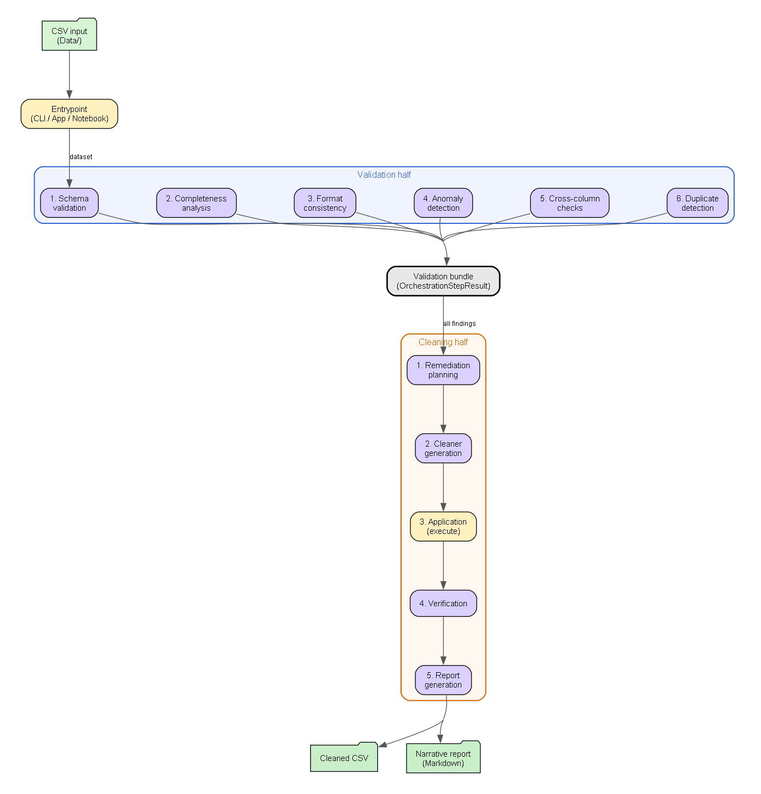
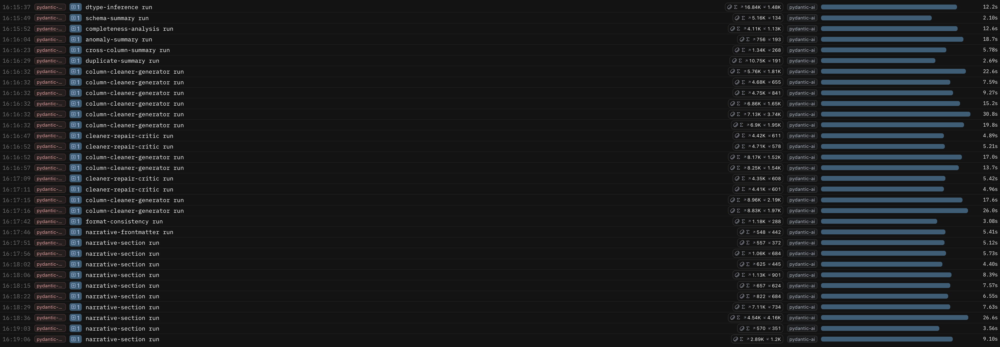
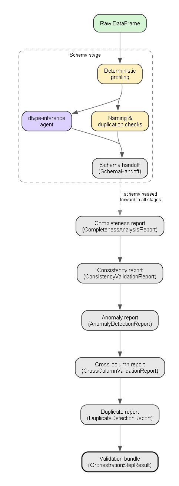
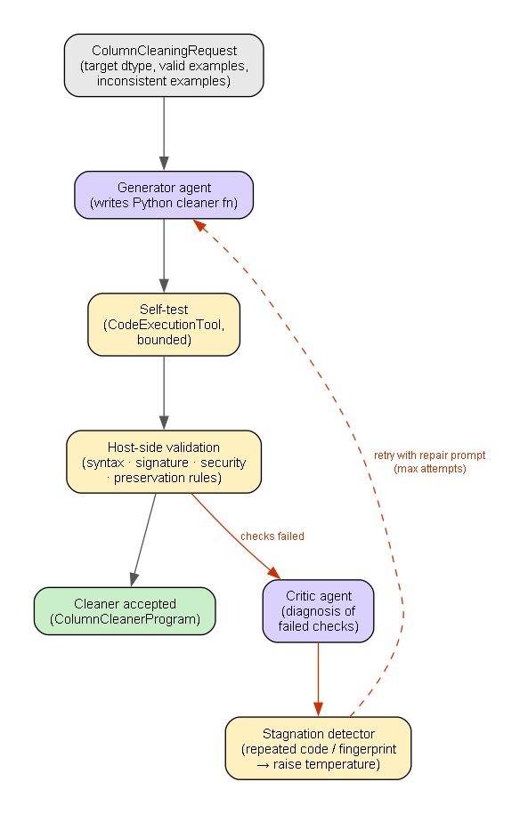

# NoiPA: Multi-Agent System for Data Quality

**Team members:** Michele Turco, Mattia Sebastiani, Sofia Bruni

This repository documents a project developed for the Machine Learning course for the academic year 2025/2026 in collaboration with Reply. The project studies how a **multi-agent system** can be used to inspect heterogeneous tabular data, identify several families of data-quality problems, apply controlled cleaning actions only where those actions are justified, and finally produce a report that explains both the detected issues and the effect of the remediation process. 

The **central idea** is that data quality should not be treated as a single undifferentiated task. Missing values, placeholder abuse, inconsistent formats, duplicate structures, suspicious anomalies, and cross-column contradictions are different problems and require different forms of evidence and different intervention policies.

The **repository** contains both **implementation code** and **explanatory material**. The notebook `main.ipynb` is intended to present the workflow in a readable, didactic manner. The **command-line entrypoint** in `src/entrypoints/` and the **Streamlit application** in `app.py` expose the same underlying pipeline for operational execution. The code is therefore not centered on the notebook alone: the **real system logic** resides in the modules under `src/core/`, `src/tools/`, `src/validation/`, `src/cleaning/`, and `src/entrypoints/`.

## Section 1. Introduction  Parte di sofia 

### 1.1 Project Context and Institutional Setting

The project originates from a **data-quality scenario inspired by NoiPA**, the digital platform of the Italian Ministry of Economy and Finance that manages administrative and payroll-related data for employees of the Italian Public Administration. In this setting, **data** may arrive from **different sources** and in **different formats**, such as CSV files, JSON exports, or database extracts. Even when the information is present, it may **not be immediately reliable** for analysis or downstream processing, because the same concept can be encoded in inconsistent ways across rows, columns, or files.

This kind of context is particularly suitable for a data-quality project because the **main difficulty** is not the lack of data alone, but the **gap** between **availability and usability**. A dataset may look populated while still being difficult to trust. Dates can appear in several incompatible formats within the same column. Columns may contain numeric values mixed with textual decorations. Placeholder tokens may hide missingness behind apparently non-null strings. Distinct columns may duplicate one another semantically or contradict one another logically. If these issues are not isolated carefully, **later analysis inherits uncertainty** that is often **invisible at first sight**.

### 1.2 Problem Statement

The problem addressed by the repository is therefore broader than simple data cleaning. The **task** is to **design a system** that can receive a raw dataset, inspect it systematically, **understand which quality issues are actually present**, decide which **actions are safe to perform automatically**, **generate constrained transformations** when normalization is justified, and **verify that the transformations** improved the data instead of damaging it.

This **distinction** is essential. A **generic instruction** such as "clean this CSV" can easily **produce outputs** that look **plausible but are difficult to justify**. It may become unclear which evidence supported a change, whether valid values were accidentally rewritten, whether the transformation was appropriate for the semantic meaning of the column, and whether the resulting dataset is genuinely better than the original one. For a project that aims to be auditable and reliable, **this level of opacity is not acceptable**.

### 1.3 Project Objective

The **objective** of the project is to build a **multi-agent workflow** that receives a raw tabular dataset and produces **two main outcomes**. The **first outcome** is a **cleaned dataset** produced through controlled and verifiable actions. The **second outcome** is a **structured quality report** describing the issues detected in the original data, the actions selected for remediation, and the extent to which those actions improved the dataset after verification.

The **practical goal** is straightforward: take a messy CSV file, clean it, and produce a report explaining what was wrong and what was fixed. Something you can actually hand to someone and use. The **methodological goal** is about **how you do it**. The point is not just to get a clean file. It is to show that there is a right and a wrong way to use AI agents for this kind of task. The wrong way is to simply ask an LLM to fix the data and trust whatever it gives back. The right way is to keep the AI on a short leash: let deterministic code do the measuring and profiling, force the AI to produce structured outputs that can be checked, make it write cleaning code that gets tested automatically before anything is applied to the real data.

So the deeper claim the project is making is this: the **pipeline design itself** is the **contribution**. The fact that **it works is not just lucky**. It works because of **specific choices about where to use AI and where not to**, and what checks to put in place at every step.

The **agentic approach is not an optional addition** to this design. It is what makes the design feasible. Some parts of the workflow inherently require **structured interpretation** that deterministic rules cannot supply: inferring a canonical dtype from a noisy column profile, writing a narrow normalization function for a specific pattern, or producing a concise structured summary of heterogeneous findings. These are tasks where an LLM, when properly bounded, contributes something that static code cannot replicate. At the same time, the **agentic components are never standalone**. Profiling parse rates, counting placeholder values, detecting duplicate patterns, or comparing columns are performed by Python before any model is involved. The agent receives **distilled evidence, not raw data**, and its output is always verified by the host environment before it is trusted. The result is a **staged multi-agent architecture** in which each agent answers a specific question, produces a typed artifact, and is prevented from becoming the sole authority over the data.

### 1.4 Repository Structure and Usage

The **repository** is organized to **satisfy both the course deliverables and the engineering needs** of the system. The main **explanatory notebook** is `main.ipynb`, which is intended to **illustrate the logic of the pipeline**, show **intermediate artifacts**, and provide a **narrative account of the workflow**. 

The **command-line entrypoints** in `src/entrypoints/` allow the **stages to be executed individually or end to end** for operational use. The **Streamlit application** in `app.py` exposes the same stages through an **interactive interface**.

The **main codebase** is under `src/` and is organized into `core/` for shared logic and models, `tools/` for rule-based data processing, `validation/` for the inspection stages, `cleaning/` for planning fixes, generating code, applying changes, checking results, and reporting.

```
AgentsAI/
├── src/
│   ├── core/
│   │   ├── agents.py              # Agent definitions, MODEL constant, Logfire setup
│   │   └── models.py              # Pydantic output models (SchemaHandoff, FormatConsistencyFinding, …)
│   ├── tools/
│   │   ├── schema_tools.py        # Deterministic dtype profiling and naming checks
│   │   ├── completeness_tools.py  # Placeholder detection and completeness profiling
│   │   ├── format_tools.py        # Shape-based structural profiling
│   │   └── quality_tools.py       # Anomaly, cross-column, and duplicate detection
│   ├── validation/
│   │   ├── schema.py              # Schema validation stage
│   │   ├── completeness.py        # Completeness analysis stage
│   │   ├── consistency.py         # Format consistency validation stage
│   │   ├── anomaly.py             # Anomaly detection stage
│   │   └── cross_column.py        # Cross-column and duplicate detection stage
│   ├── cleaning/
│   │   ├── request.py             # ColumnCleaningRequest construction
│   │   ├── generation.py          # Cleaner generation and critic–repair loop
│   │   ├── validation.py          # Host-side cleaner validator
│   │   ├── application.py         # Apply cleaners and structural actions
│   │   ├── verification.py        # Post-cleaning verification against original findings
│   │   └── reporting.py           # FinalPipelineReport assembly
│   └── entrypoints/
│       ├── cli.py                 # Argument parsing
│       └── main.py                # Stage-level orchestration entry point
├── Data/
│   ├── spesa.csv                  # Primary evaluation dataset (7 543 rows, 18 columns)
│   └── attivazioniCessazioni.csv  # Secondary evaluation dataset (20 102 rows, 19 columns)
├── app.py                         # Streamlit interactive interface
├── main.ipynb                     # Explanatory notebook (narrative + intermediate artifacts)
├── requirements.txt
└── .env                           # OpenAI API key and optional Logfire token (not tracked)
```

In order to **run the code**, the **user needs to set up a Python environment** with the **dependencies** listed in `requirements.txt` and to provide an **OpenAI API key** through the environment. An optional **Logfire token** can also be provided to enable observability tracing (see Section 2.5 for details).
After that, to use the project, **install the dependencies** from `requirements.txt`, set the required environment variables, place the **datasets** in `Data/`, and run the pipeline from the notebook, CLI, or app.

### 1.5 Reproducibility and Environment

The repository includes a `requirements.txt` file and can be **reproduced with a standard virtual environment**. The **basic setup** is as follows:

```powershell
python -m venv .venv
.venv\Scripts\activate
pip install -r requirements.txt
```

**Agent-backed stages require an OpenAI API key** to be available through the environment, and the repository **reads environment variables through `.env` using `python-dotenv`**. The **Streamlit application** can be launched with:

```powershell
streamlit run app.py
```

The **command-line pipeline** can be run through the **packaged entrypoint**. For example, the **validation bundle** can be built with:

```powershell
python -m src.entrypoints.main Data/spesa.csv --stage validate
```

The **same interface exposes additional stages** such as `schema`, `completeness`, `consistency`, `remediate`, `generate`, `apply`, `verify`, `clean`, and `report`. 


## Section 2. Methods

### 2.1 General System Architecture

The **overall architecture** is based on a **strict separation** between inspection, diagnosis, remediation planning, transformation, and verification. This choice reflects the view that in order to obtain a good result, the **optimal approach** is **dividi et impera**

The workflow begins by **loading a dataset and building deterministic evidence about it**, then **translating those observations** into **structured findings**. Only after those have been formalized does the **system decide whether a corrective action is justified**. When executable **cleaning logic is needed**, the latter is **generated under a narrow contract** and is **validated by the host system** before being trusted. After application, the **dataset is checked again** to confirm that the **targeted issue was actually reduced**.

This architecture serves **two purposes**. The first is **technical safety**. If one stage fails, the failure can be localized instead of contaminating the rest of the workflow invisibly. The second is **interpretability**. Because every stage emits a specific typed artifact, the intermediate state of the system can be inspected, cached, reloaded, and discussed both in the notebook and in the final report.



This figure is the **broad architectural overview** of the repository. It is useful in this section because it makes visible the **main split between the validation half and the cleaning half**, while still preserving the end-to-end flow from raw CSV input to cleaned dataset and narrative report.

### 2.2 Main Execution Surfaces

The **same pipeline logic** is exposed through **three surfaces**: the notebook `main.ipynb` for narrative illustration, the CLI in `src/entrypoints/` for stage-by-stage or end-to-end operational runs, and the Streamlit app in `app.py` for interactive use. All three surfaces share the same underlying modules, so the system should not be read as a notebook prototype.

### 2.3 Data Ingestion and Initial Framing

The **dataset** is loaded into a pandas dataframe and becomes the **authoritative input for validation**. In the **verification stage**, the **cleaned output may be re-read** as **strings** so that formatting **differences** are **not hidden by automatic dtype normalization**. This detail is important because the **project evaluates** not only semantic compatibility but also whether the **cleaned values respect the intended canonical representation**. In other words, the **system** is **not satisfied** by a **value that merely parses**; it also **cares** whether the **value has been normalized into the correct target form**.

### 2.4 Contract Layer and Typed Artifacts
One of the defining engineering choices of the repository is the use of **Pydantic models** as a **contract layer**. The file `src/core/models.py` defines the **structured objects** that **move from one stage to another**. This means that the **output** of a stage is not a free-form paragraph that must later be reinterpreted, but a **validated artifact with an explicit schema**.

This choice is central to the **reliability of the pipeline**. In an **agentic workflow**, one of the main **risks** is not only that a stage may produce an incorrect answer, but that it **may produce an answer with the wrong structure**. A **malformed handoff** can **silently poison every downstream stage**. Typed artifacts reduce this risk and improve traceability. They also make it **possible to cache intermediate results**, **compare runs, and expose internal state clearly** in the notebook and in the application.

### 2.5 Agent Runtime, Retries, and Observability

All **agents are defined** centrally in `src/core/agents.py`, and all runtime control is routed through **shared utilities**. This layer exists because **LLM calls are the least deterministic** and most failure-prone component of the pipeline. Rate limits, transient connection failures, and inconsistent retry logic would make the system difficult to reason about if every module handled them independently.

The repository therefore **centralizes model configuration, tracing, and retry policy**. **Logfire** is used for **observability** and **environment variables** are loaded through `python-dotenv`. The **current configuration** in `src/core/agents.py` sets the shared model to `openai-responses:gpt-5.4-nano`, although the design allows the model choice to be changed in one place rather than scattered across the codebase. This **centralization supports repeatability and debugging**: a failed agent call can be inspected as a single event inside a larger engineered process.



The Logfire trace shown above is aligned with this description. It displays **individual agent runs as separate observable events**, including validation agents, repeated `column-cleaner-generator` attempts, `cleaner-repair-critic` iterations, and narrative-report steps, together with timestamps and run durations. It therefore makes the **operational structure of the pipeline visible during execution**, rather than only after the final artifacts have been written.

**Observability tracing is opt-in and credential-gated**. Logfire instrumentation is activated only when a `LOGFIRE_TOKEN` environment variable is present. If the token is absent, the pipeline runs in full without any tracing side effects. This means that the system can be executed in a minimal environment with only an `OPENAI_API_KEY`, and tracing can be enabled separately when a Logfire project is configured. The `.env` file shown in the repository structure (Section 1.5) is the intended location for both credentials. When Logfire is active, every agent invocation, tool call, retry attempt, and stage transition is recorded as a structured span, which makes it possible to audit exactly what the pipeline did during a run, at what cost, and where failures or retries occurred.

### 2.6 Detailed Pipeline Stages

The following subsections describe the ordered validation, remediation, cleaning, verification, and reporting stages that make up the operational pipeline.

#### 2.6.1 Schema Validation
**Schema validation** is the **first domain-facing stage**. Its **purpose** is to **establish what each column is supposed** to **represent after cleaning**, rather than merely describing how the raw values happened to be stored. This **distinction is fundamental**. A column may be loaded as strings while still being, in substance, a date field or a numeric field corrupted by a minority of messy values. What the **system tries to understand** is what a **certain column is meant to represent rather than how it happens to be encoded** in the raw data. The **schema handoff makes this visible** in a concrete way.

Each column that passes through the schema stage produces a `SchemaHandoff` entry (see the JSON artifact later in this section). The most important fields in that entry are `pandas_dtype`, which is the inferred target dtype after cleaning, and `detected_pattern`, which is the canonical form the cleaned values should follow. Both fields are produced by the `dtype-inference` agent from the bounded column profile. The table below maps those fields back to concrete columns from the two evaluation datasets.

| Dataset | Column | Raw dtype | Representative raw values | `detected_pattern` | Target `pandas_dtype` |
|---------|--------|-----------|--------------------------|--------------------|-----------------------|
| `spesa.csv` | `rata` | `object` | `202402`, `2024-06`, `04/2024`, `FEB-2024` | `YYYYMM period key` | `Int64` |
| `spesa.csv` | `spesa` | `object` | `182904.47999999954`, `2110811.34`, `N.D.` | decimal amount | `Float64` |
| `spesa.csv` | `aggregation-time` | `object` | `2024-03-11T02:01:04.421`, `24.10.2024`, `2024/04/11` | ISO-8601 datetime | `datetime64[ns]` |
| `spesa.csv` | `2cod_imposta` | `object` | `1010`, `1030`, `2010` | integer tax code | `Int64` |
| `attivazioniCessazioni.csv` | `mese` | `object` | `11`, `7`, `NOV`, `Novembre`, `mese 2` | `month number (1-12)` | `Int64` |
| `attivazioniCessazioni.csv` | `anno` | `object` | `2023`, `23`, `2023.`, `anno 2023` | `4-digit year` | `Int64` |
| `attivazioniCessazioni.csv` | `aggregation-time` | `object` | `2025-06-18T16:15:20.148346`, `GIU 18 2025`, `18.06.2025`, `2025/06/18` | ISO-8601 datetime | `datetime64[ns]` |
| `attivazioniCessazioni.csv` | `provincia_sede` | `object` | `Roma`, `MI`, `NAPOLI`, `Torino ` | normalized province label | `string` |

The `detected_pattern` field is the value that the consistency stage (Section 2.6.3) will later use as a semantic contract when deciding whether observed value shapes count as inconsistent.


The stage begins with **deterministic profiling** in `src/tools/schema_tools.py`. It computes non-null counts, distinct counts, numeric parse percentages, datetime parse percentages, and representative value samples. 

One particularly important **design choice** is that the `dtype-inference` prompt does **not receive the whole column**. It receives a **bounded instance of the column** built from a random sample of up to **5% of dataset rows**, capped at **500 unique non-null values per column**, together with the column name and whole-column parse statistics. This is a deliberate **compromise between interpretability and cost efficiency**. The sample is not enough to reproduce the entire empirical distribution of a large column, but it is often enough to show the agent what the column is trying to represent. If, for example, the raw pandas dtype is `object` but the sampled values are all strings corresponding to numbers between `1` and `12`, the agent can reasonably infer that the true cleaned dtype should be `Int64` rather than free text. In the same way, a column whose raw values are strings may still clearly reveal itself as a date field, a code, or a decimal measure once the sampled values are read together with the column name.

This **sampling strategy** is important because the repository does **not want to spend tokens on entire columns** when the purpose of the stage is conceptual inference rather than exhaustive memorization. The **sample** gives the **LLM a concrete local view of the column**, while the **numeric and datetime parse percentages** give it a **global statistical view** over the full column. In practice, the **agent** is asked to **reason over both perspectives** at once: what the values look like in a bounded sample, and how strongly the entire column behaves like a numeric or datetime field. This is **what allows the system to remain relatively economical** while **still making a semantically informed dtype decision**.

The same `dtype-inference` call **returns** not only the **target cleaned pandas dtype**, but also the **semantic role of the column and a dominant canonical pattern** when that pattern is clear enough. In other words, the dominant pattern is not deferred to a second dtype-inference call. It is **already part of the schema-stage inference**. In parallel, **deterministic naming checks identify unsafe column names** and **duplicate-semantic groups**. The **result** is merged into a structured `SchemaHandoff`.

This **hybrid design is deliberate**. **Parse rates and naming rules** are **straightforward deterministic checks**. Interpreting a messy profile as a cleaned target dtype benefits from semantic reasoning, but only when that reasoning is grounded in bounded evidence rather than raw unrestricted data. The stage therefore **uses Python for measurement and the agent for constrained interpretation**, then **passes the inferred dtype and pattern information** forward to the **later consistency stage**.


    {
      "name": "RATA",
      "pandas_dtype": "Int64",
      "numeric_role": "code",
      "string_role": null,
      "detected_pattern": "YYYYMM period key (with some month-name formats)",
      "rationale": "Numeric parsing is high (96.0%) and dominant values are compact period keys like '202311' and '202307'; mixed textual month formats (e.g., 'LUG-2024', 'DIC-2023') are treated as corruption/noise for the intended period key.",
      "non_null_rows": 20102,
      "distinct_non_null_values": 96,
      "numeric_parse_pct": 96.01034722913143,
      "datetime_parse_pct": 0.0,
      "empty_like_pct": 0.0,
      "sample_values": [
        "202311",
        "202307",
        "202308",
        "202304",
        "202306"
      ],
      "naming_valid": false,
      "rename_suggestion": "rata",
      "naming_reason": "Column name contains uppercase letters, which violates the lowercase snake_case naming rule."
    }

#### 2.6.2 Completeness Analysis

Completeness analysis exists because **missingness in real datasets is often disguised**. A naive null count is usually insufficient. 

The system **handles this issue** by first defining a **list of potential placeholder tokens** such as `N/A`, `-`, `unknown`, empty strings or other values that should be treated as signals of absence rather than as genuine content. 

In the implementation, this **list is used to normalize raw cell values** and **compare them against known missing-like forms**. As a result, the system does not restrict missingness detection to formal nulls alone. It also **treats configured placeholders**, once normalized, as **values that are semantically equivalent to missing data**. This is an important design choice because many administrative datasets contain cells that are technically non-null but informationally empty.

Starting from this placeholder list, `src/tools/completeness_tools.py` **builds a deterministic completeness profile**. It computes completeness percentages, detects missing-like tokens, records representative placeholder examples, and marks sparse columns. More specifically, the **completeness logic constructs a missing-like mask** that merges true nulls, empty strings, and configured placeholder values into one unified notion of absence. This profile is then **interpreted** by the `completeness-analysis` agent, which **returns** a **structured report with per-column recommendations**.

The **role of the agent** at this stage is not to discover missingness independently, but to **transform measured evidence into a downstream-readable handoff**. The **practical benefit** is that **later stages do not need to repeat the same reasoning**. They receive an explicit statement of which columns contain hidden missingness, which placeholder families are present, and whether some columns should be reviewed because they contain almost no meaningful information.


    {
      "column_name": "regione_sede",
      "completeness_pct": 96.39339369216994,
      "missing_like_count": 725,
      "missing_like_examples": [
        "",
        "?",
        "n.d.",
        "-",
        "//"
      ],
      "sparse_candidate": false,
      "recommended_action": "Normalize placeholder tokens (including empty string, ?, n.d., -, //) and review missing/placeholder values in regione_sede"
    }


#### 2.6.3 Format Consistency Validation

**Format consistency validation** is the **stage that connects diagnosis to executable cleaning**. Its **purpose** is to **identify columns whose values are semantically similar but structurally inconsistent** in ways that justify normalization. Typical examples include mixed date layouts, mixed encodings for period identifiers, or numeric fields that include punctuation or textual noise.

The **first important point** is that the **consistency stage does not start from scratch**. It receives the **schema handoff** described in Section 2.6.1, and therefore it already knows the **target cleaned dtype** and, when available, the **semantic canonical pattern** inferred earlier. That semantic pattern is stored as `detected_pattern` in the `SchemaHandoff` object and **expresses what the column should mean in its clean form**, for example `YYYYMM period key`, `4-digit year`, or `month number (1-12)`. The consistency stage then **complements that semantic contract with a raw structural profile** computed directly from the observed values in `src/tools/format_tools.py`.

This **structural profile** is built by **rendering non-null, non-empty values as strings** and **abstracting them through a shape function**. The shape function replaces every digit with a representative digit placeholder and every letter with a letter placeholder, collapsing consecutive identical placeholders, so that the surface structure of a value is captured without retaining its actual content. In practice, a value such as `202402` becomes the six-digit shape `999999`, a value such as `04/2024` becomes the shape `99/9999`, and a value such as `2025-06-18T16:15:20.148346` becomes a timestamp shape. The profiler **counts how often each shape appears**, **ranks the shapes by frequency**, and defines the **`dominant_shape`** as the most frequent one among the filtered values. Its relative prevalence is stored as **`dominant_shape_pct`**. Both fields appear in the `ColumnFormatFacts` object that is serialized and passed to the agent on the slow path.

The **connection between `detected_pattern` in Section 2.6.1 and `dominant_shape` in this stage is precise but operates at different levels of abstraction**. The `detected_pattern` from the schema handoff is **semantic and canonical**: it expresses what the cleaned values should mean and what form they should take after normalization. It is produced by the LLM from a bounded profile and a column name. The `dominant_shape` from the consistency stage is **empirical and structural**: it is produced by a deterministic function that renders and abstracts the raw values as they actually appear in the dataset. The two fields therefore answer different questions. `detected_pattern` answers "what should this column look like?" while `dominant_shape` answers "what does this column look like right now, in the majority of rows?"

In practice, the relationship between the two varies by column. For `rata` in `spesa.csv`, the `detected_pattern` is `YYYYMM period key` and the `dominant_shape` is `999999`, a six-digit numeric layout, which is exactly what a `YYYYMM` code produces. The alignment is almost direct. For `mese` in `attivazioniCessazioni.csv`, the `detected_pattern` is `month number (1-12)`, but the raw shapes split between `9` for single-digit months such as `7` and `99` for two-digit months such as `11`, with additional textual shapes for forms like `NOV` or `Novembre`. In this case the `detected_pattern` declares the target, while the `dominant_shape` and its distribution reveal the extent of the drift and which shape families should be treated as already valid versus inconsistent.

This pairing also explains the **schema-driven gate bypass** described later in this section. When the `detected_pattern` from the schema handoff is already unambiguous, the consistency stage can use it directly as a validation contract without asking the LLM to rediscover the target from scratch. The `dominant_shape` is still computed and stored, because it informs the agent about what the majority of rows already look like and which examples must be preserved rather than transformed. But the semantic decision of what the column is supposed to represent has already been made in Section 2.6.1 and does not need to be repeated.

This **distinction explains the two execution paths** in `src/validation/consistency.py`. If the **schema handoff already provides an unambiguous pattern**, the consistency stage can often take a **deterministic fast path**. This is especially important for **numeric and code-like columns**, where values can be **checked directly against the schema pattern** instead of asking an LLM to rediscover the target. For example, a column whose schema pattern is `month number (1-12)` can be validated against that rule even if valid raw outputs have different widths such as `7` and `11`. If **no stable schema pattern exists**, or if the pattern is too ambiguous to serve as a direct contract, the stage **falls back to the slower agent-backed path**.

Before either path is taken, the consistency stage applies **two complementary improvements** that extend its coverage beyond what the shape-based heuristic alone can detect.

The **first** is a **schema-driven gate bypass** for numeric dtype columns. The shape-based `machine_format_candidate` flag is computed from column-name keywords, so columns whose names fall outside the recognized vocabulary — such as `revenue`, `expenses`, or `discount_rate` — would otherwise be silently skipped regardless of how many inconsistent values they contain. When the schema handoff provides a concrete, unambiguous `detected_pattern` for an `Int64` or `Float64` column, the stage bypasses the heuristic gate entirely and proceeds directly to schema-guided numeric validation. The schema's `detected_pattern` is already a direct answer to whether machine-enforceable normalization is possible, making the name-based heuristic redundant in those cases.

The **second** is a **`numeric_parse_pct` fallback threshold** for temporal and identifier columns. A column such as `month` with values `1` through `12` produces two distinct structural shapes: shape `9` for single-digit months and shape `99` for two-digit months. If neither shape individually reaches the 70 percent dominance threshold, the column would be excluded even though it is clearly a numeric temporal field. The fix adds `numeric_parse_pct >= 85` as a secondary gate condition for these semantic categories. When a column is overwhelmingly numeric by parse rate, it is treated as a machine-format candidate regardless of how its numeric values distribute across different digit-widths. Critically, this change only affects the entry gate, not the validation target: the dominant shape remains unchanged, so zero-padded forms such as `03` are still treated as inconsistent against a dominant `9`.

In that **slower path**, the **format-consistency agent still does not receive the whole raw column**. Instead, it receives a **compact `ColumnFormatFacts` object** serialized as a plain-text JSON attachment. That attached artifact contains the target dtype hint, parse percentages, empty-like percentage, semantic hint, dominant shape, dominant-shape percentage, representative dominant values, grouped inconsistent examples, and a compact summary of the most frequent raw value shapes. The **prompt that accompanies the attachment** is also **explicit**: it tells the agent the dataset name, the column name, the total row count, the dominant shape, the percentage of rows matching that dominant shape, the number of inconsistent rows, and, when available, the schema-stage target dtype and semantic role.

The **amount of evidence passed to the agent is deliberately bounded**. The **dominant examples** are **capped at five concrete values**, because their **role is to illustrate what already-valid values look like** rather than to restate the full column. The **outlier families** are selected through `select_outlier_examples(...)`, which groups inconsistent values by shape, ranks those shape families by frequency, and then keeps at most ten shapes, at most ten representative concrete values per shape, and at most sixty outlier examples overall. Each **outlier value** is also **trimmed to keep the prompt readable**. In parallel, **the lower-level structural profile stores up to five top value shapes, each summarized with at most three example values**, and this **top-shape profile** is itself computed from a **bounded sample** of the **first 250 rendered values** rather than from an unbounded pass of the entire prompt payload.

The **logic behind these limits** is the **same design principle used earlier in schema inference**: the agent should receive enough evidence to understand the main structure of the column without paying the cost of seeing every raw row. The **five dominant examples** show the already-valid family that should be preserved. The **grouped outlier examples** show the main inconsistency families that may need normalization. The **top-shape summary** gives a **compact distributional view** of the column. Together, these components let the agent reason over the problem as a structured profile rather than as a long flat list of values. This keeps the call **more cost-efficient**, makes the evidence **easier to interpret**, and **biases the agent toward reasoning about recurring patterns rather than overfitting to isolated anomalies**.

The **slow path** is therefore **not an unconstrained semantic guess**. It is a **bounded decision over a pre-structured evidence bundle**. The agent examines whether the dominant family is coherent enough, whether the outlier families are substantial enough, and whether the column is a true machine-format candidate. Only then does it decide whether the observed variation should be treated as a **genuine actionable inconsistency**.

This **selectivity is essential**. **Not every variation should trigger cleaning**. Free-text fields, notes, names, or descriptive categorical columns may contain diverse content without containing any format error. The stage therefore emits a `FormatConsistencyFinding` only when a **clear canonical representation exists** and a **measurable inconsistent minority can reasonably be normalized toward it**. This is the **core trigger for later cleaner generation**.

    {
      "column_name": "RATA",
      "expected_pattern": "YYYYMM period key (with some month-name formats)",
      "inconsistent_rows": 802,
      "example_inconsistent_values": [
        "09/2024",
        "2023-09",
        "2024-04",
        "DIC-2023",
        "SET-2023",
        "12/2023",
      ],
      "evidence": "Schema handoff identified target dtype 'Int64' and pattern 'YYYYMM period key (with some month-name formats)'. Schema-guided validation found 802 rows that do not match the target numeric representation.",
      "suggested_strategy": "Target format: 'YYYYMM period key (with some month-name formats)'. Dominant valid shape: '999999' — values matching this shape are already valid, preserve them. \nExamples of already-valid values (the OUTPUT must look exactly like these): '202311', '202307', '202308', '202304', '202306'.\n\nHandle every outlier shape group below by inferring the transformation from the examples. For each group, verify your transformation produces output that matches the already-valid examples above — same length, same character structure, same field order (e.g. YYYY before MM, not MM before YYYY). Use partial matches, prefix stripping, abbreviation expansion, or abbreviation mapping as needed. Map to null ONLY when a value is completely unrecognisable — never null a value that contains recoverable information:\n\n  shape '9999-99': e.g. '2023-09', '2023-12', '2024-02', '2023-04', '2024-04'\n  shape 'AAA-9999': e.g. 'DIC-2023', 'SET-2023', 'OTT-2023', 'SET-2024', 'DIC-2024'\n  shape '99/9999': e.g. '09/2024', '12/2023', '03/2024', '04/2023', '12/2024'\n\nEVERY value in example_inconsistent_values must be explicitly handled — do not leave any outlier value unchanged unless it already matches the target format. Prefer a best-effort conversion over null whenever the value contains recoverable information."
    }


#### 2.6.4 Anomaly Detection

**Anomaly detection** is **separated from format normalization** because **suspicious values are not automatically incorrect values**. A large outlier, a rare category, or an unusual code may indicate corruption, but it may also represent a **valid edge case**. **Automatic rewriting** in such cases would be **risky**.

The repository **detects anomaly candidates deterministically** in `src/tools/quality_tools.py`. **Numeric outliers and rare categorical values are not found by prompting an LLM**, but by **running explicit local rules** over the schema-aware dataset representation. The `anomaly-summary` agent is used only afterward to **write a concise structured summary of findings that have already been computed**.

The **numeric detector** applies only to columns that the **schema stage has already classified as numeric measures**. This means that **numeric codes and indicators are excluded deliberately**, because they may be numeric without behaving like continuous quantities. The detector also **requires a minimum amount of evidence before it runs**: at least 20 parseable numeric values and at least 10 distinct numeric values. Once those conditions are satisfied, the implementation computes the first quartile `Q1`, the third quartile `Q3`, and the interquartile range

$$ IQR = Q3 - Q1 $$

Then it defines a conservative outlier band

$$ \text{lower} = Q1 - 3 \times IQR \quad;\quad \text{upper} = Q3 + 3 \times IQR$$

Any value outside that interval is **marked as an outlier candidate**. The use of $3 \times IQR$ rather than the more aggressive $1.5 \times IQR$ is **intentional**: the project **prefers to reduce false positives** on naturally skewed public-administration measures. In other words, the detector is **calibrated to surface suspicious extremes**, not to flag every moderately unusual value. The **severity** is then set to `high` when the outlier rows are at least 2 percent of the dataset and `medium` otherwise.

The **rare-category detector** follows a **different logic** because it is designed for **low- to moderate-cardinality textual columns** rather than for numeric distributions. It applies only to columns whose **dtype family is textual** and whose **schema role is not** `free_text`, `name`, or `identifier`. **Placeholder tokens are removed first** so that missing-like noise does not become an apparent category. The detector then checks that the column is **suitable for this heuristic at all**. It is **skipped** if the number of distinct labels is below 5, above 50, or so diverse that the distinct-value ratio exceeds 20 percent of the non-null rows. It is also skipped if the most common category occupies less than 20 percent of the column, because in that case the column has **no stable baseline from which "rare" can be defined meaningfully**.

If the column passes those eligibility checks, the **threshold for rarity** is computed as

$$ \text{rarethreshold} = \max(1, \lfloor 0.005 \times n \rfloor) $$

where `n` is the number of non-null, non-placeholder rendered values in the column. **Every category whose frequency is less than or equal** to that threshold is **treated as a rare-category candidate**. The total **number of rows covered by those rare labels** becomes the **affected-row count**. The **severity** is set to `medium` when at most 5 rows are affected and `low` otherwise, because rare labels are treated as **weak anomaly signals rather than as strong evidence of error**.

One additional implementation detail matters here. Before the final anomaly report is assembled, `src/validation/anomaly.py` **suppresses duplicate-semantic aliases** that were already identified in the schema handoff. This **prevents the same anomaly from being reported twice** merely because the dataset contains two columns that normalize to the same meaning. The output of the stage is therefore interpretive rather than generative. It **highlights potential risk signals that deserve attention**, but it does **not convert those signals directly into cleaning code**.

#### 2.6.5 Cross-Column Validation and Duplicate Detection

**Data quality cannot be understood only by inspecting each column independently**. A dataset may contain columns that **look reasonable in isolation and still contradict one another when compared**. Similarly, **row-level redundancy** introduces a **different class of quality issue** from format inconsistency.

For this reason, the repository includes **deterministic cross-column checks and duplicate detection** in `src/tools/quality_tools.py`. **No LLM performs these checks**. The corresponding agents, `cross-column-summary` and `duplicate-summary`, are used only afterward to **summarize findings that have already been computed by Python**. This is an **important methodological choice**: when a **relationship can be measured directly and exactly by code**, the project **prefers deterministic comparison over model judgment**.

The **cross-column stage** therefore applies **explicit programmatic rules**. **Exact and near-duplicate columns** are detected by first restricting the comparison to **eligible pairs**, meaning columns that belong to the same broad dtype family and are not obviously incomparable, such as free-text columns or a numeric measure compared against a numeric code. Values are **normalized for case and whitespace**, and the comparison is performed only on rows where **both columns contain** a **real non-placeholder value**. At least 20 comparable rows must exist, and the overlap between the two columns must cover at least 80 percent of the smaller present-value set. If the **two normalized columns agree on every comparable row**, they are **flagged as exact duplicate columns**. If they do not agree perfectly but **still agree on at least 95 percent of comparable rows**, and the number of mismatches stays below `max(10, ceil(0.05 * comparable_rows))`, they are **flagged as near-duplicate columns**. In other words, **"near duplicate" here does not mean a vague semantic resemblance**. It means a **very high row-wise agreement rate under an explicit threshold**.

The **same deterministic approach** is used for the **relational checks**. **Year-month-period mismatches** are detected by rebuilding the expected `YYYYMM` key from the year and month columns and comparing it directly against the stored period key. **Date-order violations** are detected by checking whether a likely start date occurs after a likely end date. These are **straightforward logical comparisons**, so the repository **treats them as rule-based checks rather than as interpretive model tasks**.

The **duplicate stage** follows the same philosophy at row level. **Exact duplicate rows** are detected after case- and whitespace-normalization of the full row signature. **Near-duplicate rows** are detected differently: the system first **infers a small set of likely business-key columns**, preferring identifiers, numeric codes, and temporal keys such as year, month, or `YYYYMM`. **Rows that share the same normalized key values** are **grouped together**, and **if those rows differ elsewhere** in the record they are **flagged as near-duplicate groups**. This means that near-duplicate rows are not simply "similar-looking" rows. They are rows that appear to refer to the same entity or event under the inferred key columns, while still containing some disagreement in the remaining fields.

``` json
    {
      "columns": [
        "provincia_sede",
        "Provincia Sede"
      ],
      "check_type": "duplicate_semantic_conflict",
      "severity": "high",
      "affected_rows": 105,
      "example_row_indices": [
        110,
        349,
        500,
        531,
        547,
        954,
        1437,
        1608
      ],
      "similarity_pct": 99.44,
      "evidence": "Columns 'provincia_sede' and 'Provincia Sede' normalize to the same schema name but disagree on 105 of 18842 rows where both values are present (99.44% similarity).",
      "suggested_action": "Review whether one column should override the other, whether they need reconciliation rules, or whether both must be preserved separately."
    }
```

#### 2.6.6 Validation Bundling and Remediation Planning

After schema, completeness, consistency, anomaly, cross-column, and duplicate analyses have been completed, the **outputs are bundled into a unified validation artifact**. This bundling is necessary because the cleaning half of the pipeline should consume one coherent view of the dataset rather than several loosely connected reports.



The diagram above is best read as an **ordered orchestration view** of the validation half. It correctly shows that the **schema stage comes first**, that it contains both deterministic profiling and dtype inference, and that the **validation bundle is assembled only after all six validation stages have been executed**.

The **remediation planner** in remediation.py converts the validation bundle into a **structured list of RemediationAction objects**. This is the stage where **diagnostic findings are translated into explicit allowed interventions**. Low-risk and mechanically justified findings, such as safe column renames, dtype casts, placeholder-to-null replacement, exact duplicate-column removal, or exact duplicate-row removal, become auto-applicable actions.

``` json
{
  "dataset_name": "spesa",
  "actions": [
    {
      "action_id": "cast_dtype__aggregation_time__datetime64_ns",
      "action_type": "cast_dtype",
      "object_type": "column",
      "target": {
        "column_name": "aggregation_time",
        "target_dtype": "datetime64[ns]"
      },
      "source_check": "schema_validation",
      "confidence": "high",
      "risk_level": "low",
      "auto_apply": true,
      "status": "planned",
      "reason": "Cast the column to inferred dtype datetime64[ns].",
      "preview_stats": {
        "non_null_rows": 7543
      }
    },
    {
      "action_id": "rename_column__2cod_imposta__cod_imposta_2",
      "action_type": "rename_column",
      "object_type": "column",
      "target": {
        "column_name": "2cod_imposta",
        "new_name": "cod_imposta_2"
      },
      "source_check": "schema_validation",
      "confidence": "high",
      "risk_level": "low",
      "auto_apply": true,
      "status": "planned",
      "reason": "Column name contains a leading digit, which violates the lowercase snake_case naming rule.",
      "preview_stats": {
        "non_null_rows": 7543
      }
    }
}

```

**Findings** that are **more ambiguous**, such as anomalies, near-duplicate columns, semantic conflicts, temporal mismatches, date-order violations, or near-duplicate rows, are **converted** into `manual_review` or `report_only` actions instead of being executed automatically. This policy is especially important because the s**ystem has no guaranteed knowledge of the final analytical purpose of the dataset**. A suspicious row, an anomaly, a disagreement between semantically similar columns, or a rare category may be simple noise, a dirty entry, a legacy encoding, or genuinely meaningful information that should be preserved because it could be useful or interesting for further analysis. Since that contextual knowledge is not available inside the raw dataset itself, the **pipeline adopts a conservative intervention strategy**: clear and low-risk transformations can be automated, but ambiguous findings are redirected to manual review rather than modified directly. The underlying principle is that, when the downstream purpose of the data is unknown, it is safer to surface uncertainty than to erase potentially meaningful information.

#### 2.6.7 Cleaning Request Construction

A **format-consistency finding** is not, by itself, a **sufficient contract for code generation**. Before code can be generated safely, the **system must construct a richer object** that states what the correct target looks like, which examples must remain unchanged, which examples must be transformed or nulled, and which output dtype the generated function must respect. This role is performed by the **cleaning request builder** in `src/cleaning/request.py` and related orchestration logic. 

```json
{
  "dataset_name": "spesa",
  "column_name": "aggregation-time",
  "expected_pattern": "datetime format like '2024-03-11T02:01:04.421'",
  "semantic_hint": "temporal_period",
  "target_dtype": "datetime64[ns]",
  "target_role": null,
  "dominant_shape": "9999-99-99A99:99:99.999",
  "dominant_example_values": [
    "2024-03-11T02:01:04.421",
    "2024-07-11T03:01:16.866",
    "2024-09-11T03:01:11.704"
  ],
  "example_inconsistent_values": [
    "11/01/2024",
    "24/10/2024",
    "11-11-24",
    "2024/06/11",
    "GIU 11 2024"
  ],
  "enforce_year_only_yyyymm_january": false,
  "suggested_strategy": "Datetime output contract:\n- Preserve already-valid dominant timestamps unchanged, for example '2024-03-11T02:01:04.421'.\n- The cleaned output must use that same canonical datetime layout, including the same date order, separator style, time component, and fractional-second precision.\n- For date-only inputs, emit midnight in that same canonical layout.\n- Do not just replace separators blindly. Reorder components explicitly before formatting the final timestamp.\n\nExisting shape notes:\n- '11/01/2024' -> '2024-01-11T00:00:00.000'\n- '24/10/2024' -> '2024-10-24T00:00:00.000'\n- '11-11-24' -> '2024-11-11T00:00:00.000'\n- '2024/06/11' -> '2024-06-11T00:00:00.000'\n- 'GIU 11 2024' -> '2024-06-11T00:00:00.000'"
}
```

The resulting `ColumnCleaningRequest` is the **direct interface between validation and generation**. It is **particularly important for datetime-like columns**, where careless branch logic can easily damage values that were already valid. For example, a naive cleaner that rewrites any date-looking string could take an already valid value such as `2024-03-11T02:01:04.421`, drop the original time component and fractional seconds, or even reorder the date parts incorrectly while trying to normalize outliers such as `11/01/2024` or `11-11-24`. The **request object makes the preservation requirement explicit instead of leaving it implicit**.

#### 2.6.8 Cleaner Generation, Critic Loop, and Stagnation Control

**Executable cleaning logic** is generated only for columns where the **repository has already established that a narrow normalization target exists**. For each `ColumnCleaningRequest`, the `column-cleaner-generator` agent is asked to **produce one self-contained Python function** that receives a scalar value and returns either a cleaned string or `None`.

This **stage is intentionally constrained**. The **generated code is allowed one grouped self-test** through `CodeExecutionTool`, and that permission is bounded in `src/cleaning/generation.py`. The **purpose of that self-test is limited**: it allows the model to try its function on representative already-valid and inconsistent examples before returning it. The self-test does not certify correctness. **Final acceptance remains with the host-side validator** in `src/cleaning/validation.py`.

If a **generated cleaner fails host-side checks**, the `cleaner-repair-critic` agent receives the **authoritative validation issues** and **writes a diagnosis for the next attempt**. This creates a **repair loop** in which the generator **does not simply retry blindly**, but is **guided by explicit information** about which preservation rule, parsing branch, or structural guard failed.

The repository also contains a **stagnation mechanism**. This mechanism exists because **repeated failure was observed as a practical issue during development**. A retry loop can become trapped in variants of the same failing control flow. The stagnation detector watches for repeated code or repeated validation fingerprints. When the loop stalls, the prompt **injects a structural unblock brief** and **raises the temperature conservatively from `0.2` toward `0.5`**. This strategy is documented in the codebase and in the planning notes, but it should be described as the implemented strategy rather than as a benchmark-proven optimum.



This figure belongs here because it captures the **most delicate control loop of the cleaning half**: bounded self-testing, host-side acceptance checks, critic-guided repair, and stagnation handling. In particular, it makes clear that **code generation is not a single-shot step**, but a controlled loop whose output is accepted only after external validation.

#### 2.6.9 Cleaner Application and Verification

Once the **remediation plan** and the **accepted cleaners** are available, the **application stage executes the actions in a specific order**. **Generated cleaners are applied first** while the original column identities are still intact. Placeholder-to-null actions, exact duplicate-column drops, renames, and dtype casts follow in sequence. This ordering is important because an **early rename or cast could interfere with later steps** that still rely on the original structural assumptions.

**Application alone**, however, **is not treated as success**. After the cleaned CSV is produced, the **verification stage** in `src/cleaning/verification.py` **re-runs consistency analysis and compares the new findings against the original ones**. The result is a **structured assessment** of whether each targeted issue was resolved, improved, left unchanged, or regressed. **Verification** is one of the **strongest safeguards** in the repository because it **prevents the system from equating successful code generation with successful data-quality improvement**.

#### 2.6.10 Final Reporting

The repository **separates factual aggregation from narrative explanation**. Once **validation, remediation, cleaning, and verification outputs** exist, `src/cleaning/reporting.py` builds a `FinalPipelineReport`, which functions as the **canonical factual summary of the run**. **Only after this factual object exists** does the **narrative layer generate a human-readable report** through the `narrative-frontmatter` and `narrative-section` agents.

This **separation is methodologically important**. It ensures that the **final prose is grounded in a structured artifact** rather than replacing the evidence with free-form text. The **narrative report** is therefore a **presentation layer built on top of measured and validated outcomes**, not an **independent source of truth**.

### 2.7 Design Choices and Technology Stack

The repository is built around `pandas`, `numpy`, `pydantic`, `pydantic-ai`, `openai`, `python-dateutil`, `dateparser`, `streamlit`, `logfire`, and notebook-related packages listed in `requirements.txt`. **Pydantic and PydanticAI were chosen** because the **project depends on strict structured handoffs between many stages**. A **looser conversational orchestration framework** would have made **debugging and validation significantly harder**, because almost **every stage in this pipeline must produce an artifact that can be inspected and reused by the next stage**.

The **prompt design** is also **intentionally token-conscious**. The **system generally does not send full raw columns to the model**. It sends **bounded profiles**, **capped samples**, **representative examples**, and **structured local facts**. This **reduces cost** and **encourages the model to reason over distilled evidence rather than over long noisy inputs**. The **code-execution capability** is enabled only for the `completeness-analysis` and `column-cleaner-generator` agents, and even there it is **bounded**. The repository therefore **uses tool execution as a narrow controlled capability rather than as a free-form sandbox**.


## Section 3. Experimental Design

### 3.1 Experimental Goal

The experimental goal of the project is to evaluate whether the pipeline can improve the quality of heterogeneous tabular data in a controlled and verifiable way. The emphasis is not only on whether the system produces modifications, but on whether it produces justified modifications whose effects can be measured after application. In practical terms, the experiments are meant to validate the usefulness of the staged architecture itself: deterministic inspection, structured diagnosis, constrained code generation, and post-application verification.

### 3.2 Datasets and Evaluation Scope

The repository currently contains at least two datasets that can be used for evaluation: `Data/spesa.csv` with 7,543 rows and 18 columns, and `Data/attivazioniCessazioni.csv` with 20,102 rows and 19 columns. Both are suitable for the project because they are large enough to contain meaningful variation and because they reflect the kind of administrative data for which mixed encodings, placeholders, duplicates, and inconsistent formatting are realistic concerns.

The evaluation scope is column- and dataset-level rather than row-label supervised. The pipeline does not assume that a gold cleaned version of the dataset already exists. Instead, it evaluates the quality of the process through the findings detected, the actions proposed, the cleaners accepted, and the before-versus-after verification outcomes.

### 3.3 Baselines

This subsection is kept explicitly visible because the course guidelines require baseline discussion, but the final baseline implementation is not yet fixed in the current repository state. At present, the README can only state the intended comparison logic. A meaningful baseline should isolate what the agentic architecture contributes beyond simpler alternatives.

At least three baseline families are natural candidates. The first is a deterministic-only baseline that applies static cleaning rules without LLM interpretation. The second is a direct single-prompt baseline in which one model is asked to clean the dataset without the staged architecture. The third is a validation-only baseline in which the system produces findings but does not generate executable cleaners. The final README version should report whichever of these baselines is actually implemented and measured in the final experiments.

### 3.4 Evaluation Metrics

This subsection is also kept explicit rather than omitted, because the final repository must explain not only what was measured but why those measurements are relevant. The current pipeline already suggests a metric structure even though the final aggregated table has not yet been frozen.

The most relevant measurements are the number of schema issues detected, the number of columns with hidden missingness, the number of actionable format findings, the number of anomaly findings, the number of cross-column findings, the number of duplicate groups, the number of cleaning requests, the number of accepted cleaners, the fraction of cleaners accepted on the first pass, and the verification outcomes classified as resolved, improved, unchanged, or regressed. Additional engineering metrics such as retry counts, tool usage, token consumption, and estimated cost are also meaningful because the project studies an agentic system rather than only a static data transformation.

### 3.5 Experimental Procedure

A full experiment should follow the actual structure of the pipeline. The raw dataset should first be passed through validation. The resulting findings should then be bundled into a remediation plan. Where needed, cleaning requests should be generated and converted into candidate cleaners. Accepted cleaners should then be applied to the dataset, and the output should be re-evaluated by the verification stage. Finally, the run should be summarized through the final structured report and, optionally, the narrative reporting layer.

This procedure is appropriate because it evaluates the project as an end-to-end system rather than as a collection of isolated modules. At the same time, it preserves enough internal structure that failures can be localized. If a run performs poorly, it becomes possible to determine whether the problem originated in diagnosis, remediation planning, code generation, application, or verification.

### 3.6 Current Status of the Experimental Setup

The current repository already implements the main execution path needed for the experiments, including stage-wise CLI execution and final report generation. What is still pending is the final aggregation and presentation of formal baselines, consolidated quantitative metrics, and final result figures or tables generated from code for the submission-ready README.

For this reason, the present document keeps the experimental design fully visible but does not overclaim completed evaluation artifacts that are not yet finalized. This is preferable to removing the section, because it preserves the academic structure required by the course while making the current project status explicit.

## Section 4. Results

### 4.1 How Results Are Produced

The repository already defines a clear provenance for its results. Schema results are produced by `src/validation/schema.py` from dtype inference, naming checks, and duplicate-semantic grouping. Completeness results are produced by `src/validation/completeness.py` from the deterministic completeness profile and the agent-backed summary. Format-consistency results are produced by `src/validation/consistency.py` from shape profiling and actionable inconsistency detection. Anomaly, cross-column, and duplicate results are produced by their respective validation modules on top of deterministic evidence from `src/tools/quality_tools.py`.

Cleaner-generation results are produced by `src/cleaning/generation.py`. Application results are produced by `src/cleaning/application.py`. Verification results are produced by `src/cleaning/verification.py`, which compares the state of the cleaned dataset against the original findings. The final factual synthesis is produced by `src/cleaning/reporting.py` through the `FinalPipelineReport`. This provenance chain matters because it ensures that every value eventually shown in a table or figure can be traced back to a specific stage of the pipeline.

### 4.2 Current Qualitative Findings

Even before final numerical tables are frozen, the repository already demonstrates several important qualitative outcomes. First, it demonstrates that the project does not treat data quality as a single cleaning action, but as an ordered process in which different issue families are isolated and handled differently. Second, it demonstrates that executable cleaning is not triggered everywhere, but only where the validation layer has established a meaningful normalization target. Third, it demonstrates that generated code is not trusted automatically, because host-side validation and post-application verification remain mandatory stages.

The repository also documents concrete failure modes that influenced the design. Already-valid values can be damaged by overly broad cleaning branches. Date parts can be reordered incorrectly even when delimiters are recognized. Recoverable period-like values can be dropped if the logic is too aggressive. Generated functions can appear correct while still depending on outer-scope variables and therefore fail operationally. Repeated failure loops can arise if generation is retried without structural feedback. These observations are important because they show that the architecture was refined in response to real implementation difficulties rather than being designed only at an abstract level.

### 4.3 Placeholder for Quantitative Run Summary

The final version of this section should contain at least one table generated from code and extracted from a completed run. The most natural source is the final structured report produced after validation, remediation, cleaner generation, application, and verification.

The intended summary table should include, at minimum, the dataset name, the dataset size, the number of schema issues, the number of columns with hidden missingness, the number of format findings, anomaly findings, cross-column findings, duplicate groups, cleaning requests, accepted cleaners, first-pass accepted cleaners, and verification outcomes grouped into resolved, improved, unchanged, and regressed categories. Until those values are finalized, it is preferable to keep this placeholder explicit rather than filling it with provisional numbers that may later change.

### 4.4 Placeholder for Figures Generated from Code

The course guidelines require that result figures be generated from code. The repository is therefore expected to include at least one figure built from run artifacts rather than inserted as a purely decorative illustration. A natural option would be a compact plot showing the distribution of findings before cleaning and the verification outcomes after cleaning. Another reasonable option would be a per-column summary of actionable format findings and post-cleaning resolution status.

The architectural diagrams already included earlier in Section 2 are **explanatory figures**, not **result figures**. They help clarify the pipeline structure, but they do not replace the need for at least one figure derived directly from experimental outputs.

### 4.5 Interpretation of the Results

Once final quantitative runs are available, the main interpretive question should not be limited to how many issues were found. The more meaningful question is how many of the findings were actionable, how many actions were accepted safely, and how much of the targeted inconsistency was actually reduced after verification. In a project of this kind, a smaller number of conservative and verifiably beneficial interventions is more convincing than a larger number of opaque modifications.

The final discussion of results should therefore be organized around validated improvement, not only around raw activity. A system that rewrites many values without clear evidence would be less persuasive than a system that changes fewer values but explains and verifies those changes carefully.

## Section 5. Conclusions

### 5.1 Main Takeaway

The main contribution of the project is the design of a disciplined multi-agent pipeline for tabular data quality. The repository shows that LLMs can be useful in this domain when they are embedded inside a structured process that preserves deterministic evidence, typed contracts, constrained generation, and external validation. The project therefore contributes less as a demonstration of unconstrained automation and more as an example of how agentic reasoning can be integrated into a safety-oriented data workflow.

### 5.2 Observed Failure Modes

Several concrete failure modes emerged during development and shaped the final architecture. One recurring problem was the accidental damage of already-valid values by generic cleaning branches that matched broad string patterns before checking whether the input was already canonical. Another was the generation of values with the correct delimiter but the wrong semantic order, especially in date-like fields. Recoverable period encodings could also be dropped too aggressively if the logic treated partial information as unusable. At the code level, some generated cleaners failed because they were not truly self-contained. Finally, repeated local failure loops showed that generation quality does not automatically improve by simple repetition.

These failure modes are significant because they justify several architectural safeguards that might otherwise appear overly cautious. The early-exit preservation rule, host-side validation, repair-critic loop, and stagnation detector all exist because concrete forms of failure were encountered in practice.

### 5.3 Limitations

The current system still has important limitations. Final baseline comparisons are not yet fully integrated into the repository-level README results. Consolidated quantitative run tables remain to be finalized. Some intervention classes, especially anomaly handling and row-level duplicates, remain conservative and may require manual review rather than automated correction. The system is therefore not a universal autonomous cleaner for arbitrary datasets, nor is it intended to be interpreted as such.

Another limitation concerns scope. The repository is optimized for structured tabular validation and controlled normalization, not for domain-complete semantic correction. If a value is syntactically valid but factually wrong in a way that requires external business knowledge, the current architecture may flag it as suspicious at best, but it will not necessarily be able to repair it safely.

A further limitation is that the pipeline **does not reason about logical relationships between columns**. Cross-column checks (Section 2.6.5) apply explicit programmatic rules such as year-month-period consistency and date-order violations, but they do not capture domain-level logical constraints between arbitrary column pairs. An inconsistency that only becomes visible when the semantics of two columns are interpreted jointly — for example, a combination of category and amount that is internally contradictory — will not be detected unless a dedicated rule is defined.

Finally, the system has **limited effectiveness on free-text and general-purpose text columns**. The schema stage can classify a column as `free_text` and the anomaly stage can flag statistical outliers, but neither stage attempts to normalize or validate the content of narrative fields. Columns whose values are prose descriptions, names, or open-ended categorizations are deliberately excluded from most cleaning logic, because there is no stable canonical form against which to validate them.

### 5.4 Future Work

Several natural extensions follow from the present implementation. Formal baselines should be completed and measured systematically. Metrics collection should be consolidated into reproducible tables. Result figures should be generated directly from run artifacts and stored in the final submission format. Additional work could also compare different stagnation-breaking strategies, alternative model choices, stronger duplicate-resolution policies, or richer verification criteria beyond format consistency alone.

From a broader engineering perspective, future work could also expand the repository toward a more configurable policy layer in which different intervention tolerances can be selected depending on the dataset context. That would allow the same architecture to remain conservative in high-risk scenarios while being more permissive in exploratory settings.

### 5.5 Project Scope and Release Perspective

At present, the project is best understood as a course deliverable rather than as a finalized public product. The repository already contains a substantial implementation and a structured methodological rationale, but some reporting artifacts still need to be completed for submission. A future open release would be possible, but it would require additional stabilization, documentation, and experimental consolidation beyond the current academic scope.
