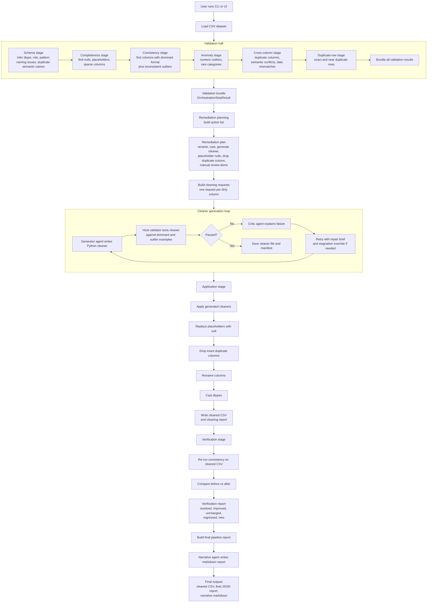

# Full Pipeline Walkthrough

The codebase is organized as a **two-half pipeline**:

```text
entrypoint -> validation -> remediation planning -> cleaner generation -> application -> verification -> final report -> narrative markdown
```

The key entry surfaces are `cli.py`, `cleaning/orchestrator.py`, and the UI wrapper `app.py`. The shared contracts live in `models.py`, agent definitions in `agents.py`, validation cache I/O in `cache.py`, and cleaning output paths in `cleaning/paths.py`.

## Walkthrough Diagram



## Mental model

The **validation half** is read-only: it inspects the raw CSV and writes JSON artifacts into `.validation_cache`.  
The **cleaning half** consumes those artifacts, generates Python cleaning functions, applies them to the dataset, writes a cleaned CSV into `.cleaning_cache`, then verifies whether the original format issues were actually reduced.

## Step-by-step pipeline

| Step | Main functions | What the stage does | Output | How the output interacts with later stages |
|---|---|---|---|---|
| 1. Entry / dispatch | `main()` and `run_stage()` in `cli.py` | Parses `--stage`, dataset path, reuse flags, concurrency, and routes to the right pipeline stage. | A chosen stage execution. | Decides whether you run only one stage or the full end-to-end flow. |
| 2. Agent/runtime setup | `setup_logfire()` in `agents.py`, `run_agent_with_backoff()` in `tools/common_tools.py` | Configures observability and standardizes all LLM calls behind one retry wrapper. | Reliable agent execution. | Every agent stage uses the same retry/backoff/runtime policy, so LLM behavior is centralized rather than scattered. |
| 3. Schema stage | `run_dtype_inference()` and `run_schema_validation()` in `validation/schema.py`, plus `build_schema_issues()` | Reads the CSV, infers target cleaned dtype/role/pattern per column, profiles columns, checks naming, detects duplicate semantic names, then asks the summary agent to write a handoff summary. | `SchemaHandoff` | This is one of the most important handoffs. Later stages use it for consistency fast-path decisions, anomaly suppression, rename planning, dtype casts, cleaner request enrichment, and rename alignment during verification. |
| 4. Completeness stage | `run_completeness_analysis()` in `validation/completeness.py` | Builds a completeness profile with nulls, placeholder tokens, sparse columns, then asks the completeness agent to turn that into a structured report. | `CompletenessAnalysisReport` | Remediation uses it to create placeholder-to-null actions. Application uses it to actually replace placeholders. Final reporting also surfaces these findings. |
| 5. Consistency stage | `run_format_consistency_validation()` and `run_column_format_check()` in `validation/consistency.py`, `build_column_format_facts()` in `tools/format_tools.py` | Profiles each column’s dominant shape and outlier shapes. If schema already knows the target pattern, it uses a deterministic fast path; otherwise it asks the format agent. `_build_suggested_strategy()` writes the downstream normalization brief. | `ConsistencyValidationReport` with `FormatConsistencyFinding`s | This is the hinge between validation and cleaning. Each finding becomes a `generate_cleaner` remediation action and later a `ColumnCleaningRequest` for code generation. Verification also uses this report as the “before” baseline. |
| 6. Anomaly stage | `run_anomaly_detection()` in `validation/anomaly.py`, heuristic detectors in `tools/quality_tools.py` | Detects numeric outliers and rare categories locally, then uses an agent only to summarize the already-built findings. | `AnomalyDetectionReport` | Remediation turns these into manual-review or report-only actions. Final report includes them, but they are not auto-cleaned. |
| 7. Cross-column stage | `run_cross_column_validation()` in `validation/cross_column.py`, detectors in `tools/quality_tools.py` | Detects exact/near duplicate columns, semantic conflicts, year-month-period mismatches, and date ordering issues. | `CrossColumnValidationReport` | Remediation converts exact duplicate columns into auto-apply drop actions, and other conflicts into manual-review actions. |
| 8. Duplicate-row stage | `run_duplicate_detection()` in `validation/duplicates.py`, duplicate detectors in `tools/quality_tools.py` | Detects exact duplicate rows and near-duplicate groups keyed by inferred identifiers. | `DuplicateDetectionReport` | Remediation records row-drop candidates or manual-review items, but row drops are not auto-applied. |
| 9. Validation bundling | `build_validation_results()` in `validation/bundle.py` | Runs schema, completeness, consistency, anomaly, cross-column, and duplicates, then packages them into one object and saves all caches. | `OrchestrationStepResult` | This bundle is the single structured input for remediation planning and the full cleaning orchestrator. |
| 10. Remediation planning | `build_remediation_plan()` in `cleaning/remediation.py` | Deterministically translates findings into actions: `rename_column`, `cast_dtype`, `replace_placeholders_with_null`, `generate_cleaner`, `drop_exact_duplicate_column`, and manual-review/report-only actions. | `RemediationPlan` | Application uses this as the action ledger. It also gets updated later with `applied`, `failed`, or `not_needed` statuses. |
| 11. Cleaning request building | `_build_cleaning_requests()` in `cleaning/orchestrator.py`, `build_column_cleaning_request()` in `cleaning/request.py` | Merges a consistency finding with fresh format facts and schema info into a `ColumnCleaningRequest`. Datetime columns get extra canonical-format instructions. | `ColumnCleaningRequest` per dirty column | This becomes the exact contract for the code generator. It tells the generator what valid values look like, what invalid examples must be transformed, and what dtype/pattern the output must satisfy. |
| 12. Cleaner generation | `run_cleaner_generation()` and `run_column_cleaner_program()` in `cleaning/generation.py` | For each dirty column: prompt the generator agent, validate the produced Python code host-side, call the critic if it fails, detect stagnation, optionally increase temperature, and retry. Accepted cleaners are saved as Python files plus a manifest. | `GeneratedCleanerArtifact`s, cleaner `.py` files, `cleaner_manifest.json` | These artifacts are the executable bridge between validation findings and actual dataset mutation. |
| 13. Host-side cleaner validation | `validate_generated_cleaner_program()` in `cleaning/validation.py`, `load_cleaner_callable()` in `cleaning/runtime.py` | Loads the generated function in a restricted namespace and checks: self-containment, runtime safety, dominant-value preservation, outlier conversion, output shape, dtype parseability, and target-pattern matching. | `CleanerValidationIssue`s or an accepted verified program | This stage is what prevents the generator from “looking correct” while actually being wrong. The critic only sees these concrete failures. |
| 14. Application | `run_cleaner_application_with_plan()` in `cleaning/application.py` | Applies the plan to the dataframe in the actual runtime order: `generated cleaners -> placeholder nulls -> exact duplicate column drops -> renames -> dtype casts`, then writes the cleaned CSV. | `CleaningReport` plus `ColumnCleanerExecutionReport`s | This is where the raw dataset is transformed. It also updates remediation action statuses and produces the cleaned CSV used by verification and reporting. |
| 15. Verification | `run_verify()` in `cleaning/verification.py` | Re-runs format consistency on the cleaned CSV, reverse-maps renamed columns back to their original identities, and computes `resolved`, `improved`, `unchanged`, `regressed`, or `new` per original finding. | `ConsistencyVerificationReport` | This closes the loop by measuring whether cleaning actually reduced the original consistency problems. |
| 16. Final report assembly | `build_final_report()` in `cleaning/reporting.py` | Merges validation, remediation, cleaning, verification, completeness details, anomaly findings, cross-column findings, duplicate groups, and unresolved risks into one canonical report object. | `FinalPipelineReport` | This is the authoritative end-state object for the whole run. |
| 17. Narrative markdown generation | `generate_narrative_report()` in `cleaning/reporting.py` | Builds a grounded briefing from the final report and asks the narrative agent to write the human-readable markdown report. | `NarrativeReport` and `.narrative_report.md` | This is the final presentation layer; it does not discover new facts, it explains the already-computed ones. |

## The most important handoff objects

| Object | Produced by | Consumed by |
|---|---|---|
| `SchemaHandoff` | Schema stage | Consistency, anomaly suppression, remediation, request building, rename/cast logic, verification rename alignment |
| `CompletenessAnalysisReport` | Completeness stage | Remediation, application, final report |
| `ConsistencyValidationReport` | Consistency stage | Remediation, cleaner request building, verification baseline |
| `OrchestrationStepResult` | Validation bundle | Remediation planning, full cleaning orchestrator |
| `RemediationPlan` | Remediation stage | Application, final report |
| `ColumnCleaningRequest` | Request-building stage | Cleaner generator and host validator |
| `GeneratedCleanerArtifact` + cleaner files | Generation stage | Application runtime, final report |
| `CleaningReport` | Application stage | Final report |
| `ConsistencyVerificationReport` | Verification stage | Final report |
| `FinalPipelineReport` | Report assembly | Narrative markdown generator |

## The key architectural ideas

1. `models.py` is the contract layer. Every stage talks to the next one through typed Pydantic objects, not ad hoc dicts.
2. `tools/*` is the deterministic profiling layer. It computes evidence; agents summarize or synthesize on top of that evidence.
3. The consistency stage is the pivot. It is the stage that turns “profiling evidence” into “columns that need executable cleaners.”
4. The generation stage is intentionally constrained. The model gets one code-execution check per attempt, while the host validator owns retries and correctness.
5. The application order is deliberate. Cleaners run before renames because cleaner manifests are keyed by original column names; casts run after renames because cast actions target the final schema names.
6. Verification is not a generic “rerun everything.” It specifically rechecks format consistency, because that is the risk the cleaner generator is meant to fix.
7. `app.py` does not introduce a different pipeline. It manually calls the same underlying stage functions as the CLI, but adds UI progress and logging.
